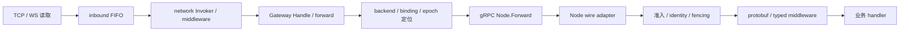

# 框架去复杂审查

**状态：三轮审查已归档，I56–I64 已实施并验证。** 审查基线为`ab0479b`，文档归档为`a9a0cf6`；2026-09-26在`9ca9ad7`上完成九项P1，实际净减54生产行、130测试行，随本次清理提交归档。当前实现、检查和边界见 [实施记录](./refactor-progress.md#cleanup-results) 与 [issue状态](./issues.md)。Gate/Node继续内嵌原生Kratos v3 App。

下文§1–13保留三轮审查时的证据、取舍和静态估算，其中“当前”“本次”“未实施”及行数均指审查时点，不作为新待办或当前验证结果。旧代码可用`git show ab0479b:<路径>`追溯；删除文件的链接已转向本次承接实现。P2和Drop未实施。

## 1. 结论与范围

当前没有足够证据判定 Yola 已出现需要大规模重构的框架膨胀。复杂度主要来自两种传输的 I/O 差异、连接替换、租约失权、就绪发布和分阶段排空；多数边界有实际契约。存在局部的配置包装、单实现接口、单一使用方内部包及测试装配重复，可以继续减少。

**三轮均没有 P0 结构性删除项。** 初次审查保留 I56–I60，第二轮新增 I61–I64，第三轮不新增P1。九项 P1 合计预计净减 **47–68 行生产文件、114–145 行测试文件**，减少 **1 个内部包、1 个生产文件、1 个内部配置类型、1 个私有 interface、3 个测试 fixture 类型和1套原子缓存发布机制**。这是静态估算，不是已经实施的收益；不承诺删除成百上千行生命周期代码。新增证据分别见 [第二轮](#round2) 和 [第三轮](#round3)，不重复计收益。

优先级沿用本次定义：P0＝高收益低风险；P1＝收益明确、建议执行；P2＝收益有限、可选；Drop＝低收益或高风险、不建议执行。P0 不是故障严重性，也不按代码行数自动判级。实际执行清单只维护在 [issues.md](./issues.md)。

### 证据来源

- 已读取根 [AGENTS.md](../AGENTS.md)，仓库内无更近目录覆盖规则；核对当前 docs、源码、调用方与测试，不将旧规划视为实施指令。
- 核验实际 `SKILL.md` 的安装与适用范围，并区分缓存目录和本会话可用能力。采用 `improve-codebase-architecture`、`codebase-design`及相关评审/并发能力，分别只读审查网络层、测试和Kratos边界；后续按当前版本重读 `golang-gopls`、`ast-grep`，实际用gopls v0.21.1核对引用/实现，用ast-grep 0.45.3搜索转交、赋值和重复结构。业务建模、故障修复、访谈及办公产物类skills不适用于本轮目标；不以语法相似证明行为等价。
- 统计使用 Go 标准库 `go/parser`/`go/ast`；路径、调用方、重复函数体再由源码复核。范围为 `gateway`、`node`、`network`、`internal`、`locate`、`registry`、`event`、`instance`，排除 `api`、`examples`、独立 `test` module 和生成文件。
- Kratos 结论来自本机固定版本源码：`github.com/go-kratos/kratos/v3@v3.0.0`，下文记作 K；etcd adapter 为 `github.com/go-kratos/kratos/contrib/registry/etcd/v3@v3.0.0-20260626125723-668db92c2c00`，记作 E。依赖版本见 [go.mod](../go.mod)。没有以更新版本的能力推断当前实现。

### 当前规模

行数为物理行，包含空白、注释及内嵌 Lua；用于限定减量预期，不作为重构评分。

| 范围 | 生产文件 / 行 | 测试文件 / 行 | 顶层 Test* 函数 |
| --- | ---: | ---: | ---: |
| gateway | 13 / 2,574 | 22 / 5,451 | 112 |
| network/websocket | 8 / 1,776 | 11 / 2,890 | 67 |
| network/tcp | 7 / 1,701 | 10 / 2,851 | 65 |
| node | 12 / 1,534 | 18 / 3,642 | 95 |
| event/nats | 3 / 574 | 10 / 1,765 | 40 |
| locate/redis | 6 / 521 | 10 / 1,291 | 21 |
| registry/etcd | 2 / 229 | 2 / 231 | 7 |
| 其余 17 包 | 24 / 1,756 | 19 / 1,725 | 63 |
| **合计 24 包** | **75 / 10,665** | **102 / 19,846** | **470** |

另有 16 个顶层 Benchmark* 函数；生产文件包含 579 个函数/方法声明、119 个命名类型声明，其中 20 个 interface 声明包含泛型约束。测试约为生产行数的 1.86 倍，不足以证明测试低效或冗余。

## 2. 复杂度来源与最长路径

**最复杂的单包是 gateway。** [server.go:49](../gateway/server.go#L49) 聚合连接认证、Session、路由、广播和停止，但已经分别交给 sessionRegistry、backends、broadcaster 和 gateclient；没有业务 Table/玩家状态。其职责属于长连接入口，继续拆成管理层只会增加装配。`network` 整个目录为 4,244 行，但它包含两种 transport 及实际共享的协议规则，不能视为一个“大包”。

**最重的生命周期在 Node。** [lifecycle.go:19](../node/lifecycle.go#L19)、[epoch.go:41](../node/epoch.go#L41)、[registry.go:21](../node/registry.go#L21)、[admission.go:12](../node/admission.go#L12) 合计 649 行，涉及准备、首次续租、过期监视、登记、两阶段准入和失败回收。Gateway 的 [lifecycle.go](../gateway/lifecycle.go) 单文件更长（386 行），但没有 Node 的跨存储发布和 epoch 释放语义。

本次核对中跨层最多的主路径是已绑定 Stateful 请求。下图表示跨协程/RPC 的处理阶段，不是调用栈深度或延迟测量：



TCP 分支主链涉及 [server_tcp.go:198](../network/tcp/server_tcp.go#L198)、[dispatcher.go:38](../network/internal/inbound/dispatcher.go#L38)、[invoke.go:20](../network/invoke.go#L20)、[inbound.go:51](../gateway/inbound.go#L51)、[forward.go:20](../gateway/forward.go#L20)、[backend.go:94](../gateway/backend.go#L94)、[cluster.go:25](../node/cluster.go#L25)、[dispatch.go:19](../node/dispatch.go#L19)、[register.go:59](../node/register.go#L59) 九个手写文件，不含 Locator、生成代码和业务 handler。多数阶段执行独立校验或协议转换；合并 Node 入站文件能减少阅读跳转，不能省掉 gRPC、middleware 或 fencing。

最明显的重复 abstraction 是内部 Queue 的 option 装配和 TCP 的单实现 `frameAppender`。重复最多的易清理部分在测试 fixture；没有确认失去调用方的大块兼容层。已有共享 `auth`、`heartbeat`、`request`、`queue` 规则应继续复用。

## 3. P1：收益明确，建议执行

<a id="i56"></a>
### I56 · 内部 Queue 直接构造

- **位置与现状**：[queue.go:24](../internal/queue/queue.go#L24) 用 `Option`、`WithCapacity`、`WithPanicHandler`、默认值及循环装配；两个生产调用 [tcp/client.go:91](../network/tcp/client.go#L91)、[websocket/client.go:84](../network/websocket/client.go#L84) 都显式传入容量和 panic handler。
- **复杂性**：固定的两参数内部对象多了一套配置闭包和组合规则，没有当前替换场景。
- **建议**：改为内部 `New(capacity, panicHandler)`，删除 Option 机制和默认装配，同步已有调用方及测试。保留 PanicHandler 类型、非法容量 panic、队列执行和终止协议；不动公共 TCP/WS ClientOption。
- **收益 / 风险**：净减 24–30 生产行、1 类型和2个配置函数；低风险。不能顺便改变 Stop、terminal callback 或队列容量。
- **验收**：现有 queue 容量、FIFO、panic、终止及 TCP/WS callback/关闭测试；格式化、make check/lint，三个受影响包 race。**建议执行，置信度高。**

<a id="i57"></a>
### I57 · 删除 TCP 单实现私有接口

- **位置与现状**：[codec.go:118](../network/tcp/codec.go#L118) 的 `frameAppender` 只有 `protoFrameCodec` 一个实现；`:127`、`:131` 的两个方法只转交 protobuf 函数，使用处为 `writeFrame`、`writeFrameAppend`、`validateFrame`。
- **复杂性**：把当前默认 codec 的特例表示为可替换 interface；包外 custom codec 无法实现这些包私有方法。
- **建议**：识别现有具体类型，在原 append 分支直接使用相同的 `proto.Size`、`MarshalAppend`；删 interface 和两个转交方法，保留公开 `encoding.Codec` fallback。
- **收益 / 风险**：净减 10–16 生产行、1 私有 interface、2 方法；低风险。必须保持校验、Flush、Marshal、Write 的顺序、错误身份和自定义 codec 行为；不宣称性能收益。
- **验收**：现有 codec round-trip、超大帧、unknown fields、custom codec 测试及 check/lint。**建议执行，置信度高。**

<a id="i58"></a>
### I58 · 单一使用方 header 包内收

- **位置与现状**：原`network/internal/header/header.go:11`的Carrier（现为 [headerCarrier](../network/transport.go#L55)）在生产代码中只由Transport使用；TCP/WS测试仅额外引用`ConnectionIDKey`。
- **复杂性**：Transport 的私有实现细节独立成包，需要跨目录阅读；不提供独立资源、替换或共享边界。
- **建议**：把实现原样移到 `network/transport.go` 的私有类型，测试迁到 `network/transport_test.go`；[TCP:57](../network/tcp/client_server_test.go#L57)、[WS:42](../network/websocket/client_server_test.go#L42) 直接验证协议字面量 `conn_id`。保留大小写归一化、多值和空值语义，不换成 Kratos Metadata。
- **收益 / 风险**：净减 5–12 生产行、1 包和1生产文件；测试迁移产生一个目标文件，总文件净减1。Carrier 的逻辑和类型仍存在，不把40行迁移计为40行删除。风险低。
- **验收**：原 header 行为测试和 TCP/WS context 接线测试全部保留；多包 check/lint。**建议执行，置信度高。**

<a id="i59"></a>
### I59 · 复用两种 transport 各自的 callback fixture

- **位置与现状**：[tcp/client_test.go:408](../network/tcp/client_test.go#L408) 与 [tcp/test_helpers_test.go:13](../network/tcp/test_helpers_test.go#L13)、[websocket/client_server_test.go:100](../network/websocket/client_server_test.go#L100) 与 [websocket/test_helpers_test.go:23](../network/websocket/test_helpers_test.go#L23) 各有一对重复 handler。Handle/Close 相同，Open 仅在 callback fixture 中向 opened 通道发送连接。
- **复杂性**：同包内重复维护协议回复及空 Close，六个构造点可使用现有基础 fixture。
- **建议**：基础 fixture 增加实际需要的可选 opened 通道，非 nil 时保留原同步发送，替换六个构造；删除两个重复 fixture 类型及其方法。不建立跨包 testutil/manager。
- **收益 / 风险**：净减 25–35 测试行、2 类型；不删除测试或 case。风险低，但通道容量、发送时机和 cleanup 顺序必须保持。
- **验收**：TCP/WS callback 顺序、callback 内 Close、认证 Push、连接关闭测试及 race；多包 check/lint。**建议执行，置信度高。**

<a id="i60"></a>
### I60 · 合并 NATS 重复装配，保留不同入口

- **位置与现状**：原`event/nats/subscription_test.go:243`、`:267`及`stats_test.go:107`分别测试超限接收、panic后继续处理、payload/panic统计，主体共57行；本次合并后的场景见 [stats_test.go:108](../event/nats/stats_test.go#L108)。
- **复杂性**：三个 broker/Bus/订阅场景重复装配，但不能原样只保留 stats 测试：前者使用独立 publisher，panic 场景通过 Bus.Publish 且后一次正常返回；stats 使用原生 conn.Publish 且两次都 panic。
- **建议**：合成一个场景。独立 publisher 发超限数据，确认 PayloadDropped=1 且 handler 未调用；合法边界、空 payload 通过 Bus.Publish 发送；前两次 handler panic，第三次正常返回。关闭后保留 Calls=3、Panics=2、PayloadDropped=1、QueueDropped=0、Closed=true 及 QueueDroppedCurrent=false 的断言；最后一项保护原生订阅退出后的统计有效性边界。
- **收益 / 风险**：扣除新增装配与断言后净减15–25测试行、2个顶层测试，覆盖不减少。低风险；这是合并，不是可以直接删除两个测试的证明。
- **验收**：NATS 包测试/race 和 lint；禁止同时删掉 backlog、取消、重连或 broker 上限测试。**建议执行，置信度中高，实施时复核合并后的实际净收益。**

## 4. P2：可选收敛，不进入当前执行清单

以下按职责邻近程度提出，不以减少文件数立项；每项均尚未实施。

| 位置与当前结构 | 为什么复杂 / 如何简化 | 净收益估算 | 风险与建议 |
| --- | --- | --- | --- |
| [node/cluster.go:25](../node/cluster.go#L25)、[dispatch.go:19](../node/dispatch.go#L19)、[command.go:9](../node/command.go#L9)，三个小文件共同说明入站请求 | 合到 dispatch.go，保留 wire adapter、fencing 和 command context 声明及顺序，集中读入站流程 | 生产14–18行、2文件；0类型/接口 | 低；P2 可选，不能把合文件解释为删掉协议边界 |
| [network/stats.go:3](../network/stats.go#L3) 独立放 Connection 的可选能力 | 合到 [connection.go:35](../network/connection.go#L35)，与 PreparedConnection 同处定义能力 | 生产1–3行、1文件 | 低；P2，仅阅读位置收益 |
| [event/nats/options_test.go:12](../event/nats/options_test.go#L12) 用 `func(options) any` 表验证6个 setter | 改成直接应用和断言；保留所有6组输入、UserInfo、URL脱敏及 TLS clone | 测试30–38行；不删顶层测试 | 低；P2，不把 case 数下降误当覆盖提升 |
| [gateway/inbound_test.go:14](../gateway/inbound_test.go#L14) 单独测试认证不依赖 Node 在线 | 原样并入 auth_test.go，现有 import 已够用 | 测试12–13行、1文件 | 低；P2，场景不可删 |
| [node/session_lifecycle_test.go:17](../node/session_lifecycle_test.go#L17) 与 session_test.go 分散 Session 行为 | 合入 session_test.go，约243行；不并入更大的 lifecycle_test.go | 测试10–12行、1文件 | 低；P2，保留全部 synctest 屏障及4个生命周期测试 |
| [locate/redis/decode_test.go:15](../locate/redis/decode_test.go#L15) 实际测试 key、存储值、输入契约 | 并入 locator_test.go，保留5个测试，避免 decode 名称掩盖存储契约 | 测试8–13行、1文件 | 低；P2，内部存储断言有契约价值 |
| [node/push.go:58](../node/push.go#L58) 的错误映射含 nil case | 唯一调用在同文件42–43行的 err != nil 分支，可删 nil case | 生产2行 | 低；P2，不值得独立 issue；其他两个错误映射的 nil 分支仍必要 |

Queue.Submit 虽转交 SubmitBatch，却表达单项提交并集中规则；删除只会把调用点改成不准确的批量名称，保持不变。`locate/redis` 的单 key run、key 编码和结果解码也有真实复用，不继续制造“统一存储执行器”。

## 5. Drop 与保持不变的边界

以下不是待实施 issue。表中的简化是假设方案，经当前代码核对后不推荐；不能把理论可删行数计入收益。

| 拟删除或合并的结构 | 当前代码证据 / 为什么存在 | 收益与风险 / 结论 |
| --- | --- | --- |
| 用 Kratos Start 取代 Node readyRegistrar | [node/registry.go:21](../node/registry.go#L21) 在核验后才登记；K `app.go:115` 在 `server.Start` 前调用 wg.Done，`:123` 随即可能登记 | 仅减少适配代码，却丢失首次续租/登记屏障；高风险，Drop |
| 删除 Run 返回后的显式清理，只留 App.Stop | K `app.go:84–97,123–129` 在 Endpoint/hook/注册失败后直接返回；`:166–167` 注销失败早于 cancel。应用负责的清理见 [examples/whot/main.go:77](../examples/whot/main.go#L77) | 会泄漏尚未由 Serve 接管的资源或无法终止应用；高风险，Drop。保持外层为唯一 App |
| 删除 listener.Owner | [owner.go:35](../internal/listener/owner.go#L35)、[:66](../internal/listener/owner.go#L66) 管理 Endpoint 惰性 bind 及 Serve 前关闭；Gate/Node 共用，K `transport/grpc/server.go:208,249` 的时序不替代该责任 | 101行有明确双调用方与资源所有权，非空 wrapper；高风险，保持不变 |
| 直接用官方 etcd Registrar，删除 Yola 注册器 | E `registry.go:168` 无条件 Put、`:127` 按 key Delete、`:175` 起丢租后重新登记；Yola [registrar.go:52](../registry/etcd/registrar.go#L52)、[:104](../registry/etcd/registrar.go#L104) 只创建空 key、只撤本代 lease；[registry.go:77](../registry/etcd/registry.go#L77) 已复用官方 Discovery | 表面省229行，但会失去记录所有权，旧代可覆盖/删除新代；高风险，Drop |
| 把 Registry session==nil 判断当死代码；直接 Session.Close | [registrar.go:67](../registry/etcd/registrar.go#L67) 对应固定 etcd client v3.7.1 `concurrency/session.go:59–61` 可能返回 `(nil,nil)`；该依赖 `:102–114` 的关闭预算也不同 | 省行极少或改变取消/lease回收，风险高；保留判断和调用方预算，Drop |
| 合并 Node requests / deliveries | [lifecycle.go:97](../node/lifecycle.go#L97) 先等入站，再业务 Drain，再关出站；[session_lifecycle_test.go:89](../node/session_lifecycle_test.go#L89) 保护 Drain 内绑定能力 | 两者关闭时机不同；合并会拒绝合法 Drain 工作或提前释放 epoch，高风险，Drop |
| 合并 identity 快照与 epochLease.identity | [lifecycle.go:247](../node/lifecycle.go#L247) 先撤可服务身份，仍留固定凭据供 [epoch.go:244](../node/epoch.go#L244) 重试释放；Stateless 又没有 lease | 不是重复可变状态。少一个对象不能抵消清理凭据丢失风险，Drop |
| 合并 epoch 监视和续租 goroutine | [epoch.go:90](../node/epoch.go#L90)、[:109](../node/epoch.go#L109)、[:135](../node/epoch.go#L135) 分别监视截止与续租 I/O | 存储忽略取消时会延迟 fencing；高风险，Drop，保留独立监视 |
| 统一 TCP/WS Server、Client、Channel | [tcp/channel.go:133](../network/tcp/channel.go#L133) 的阻塞 reply/关闭等待不同于 [websocket/channel.go:142](../network/websocket/channel.go#L142) 的先查容量再同步编码；deadline 与最后一帧语义也不同 | 需要策略回调、更多分支和状态才能维持行为；无净收益证据，高风险，Drop |
| 合并 TCP closing/stop/writerDone；用 len(channels) 代替 WS connCount | [tcp/channel.go:24](../network/tcp/channel.go#L24) 区分拒绝发送、终止writer、writer完成；[websocket/server.go:340](../network/websocket/server.go#L340)、[:354](../network/websocket/server.go#L354) 区分 Upgrade 前预占和已登记连接 | 它们代表不同阶段；删除会破坏最后一帧或并发连接上限，高风险，Drop |
| 合并 tcpConnection 与 channel | [server_tcp.go:269](../network/tcp/server_tcp.go#L269) 的 CloseWithProto 还负责校验失败不关 socket、进入关闭后回收 socket | 保留行为后只省少量装配行，却扩大 I/O 与队列状态的修改面；收益低，Drop |
| 合并两种连接池与发现快照 | [gateway/backend.go:94](../gateway/backend.go#L94) 按 service 管理发现连接；[gateclient/client.go:95](../internal/gateclient/client.go#L95) 按 endpoint 管理在途与空闲回收；[balancer.go:68](../gateway/balancer.go#L68) 的 Ready SubConn 不是 Registry 快照 | 会新增寻址/回收策略；高风险且增加抽象，Drop。lastUsed 也防止已开始的旧 timer callback 提前回收，不能直接删除 |
| 用原生 discovery resolver/picker 取代 Gateway 适配 | [resolver.go:110](../gateway/resolver.go#L110) 在空实例时清空旧地址并校验固定 sticky；[balancer.go:22](../gateway/balancer.go#L22)、[:68](../gateway/balancer.go#L68) 还需精确 NodeID 选择 | 默认路径不等于当前 fail-closed 与精确路由契约；收益不足以承担路由回归，Drop |
| 删除 Node protobuf 注册层、改用内部 gRPC middleware | [register.go:66](../node/register.go#L66) 给 middleware 的是业务 protobuf；K `transport/grpc/interceptor.go:23` 面向 cluster ForwardRequest | 输入类型与 operation 不同；[command_test.go:23](../node/command_test.go#L23) 保护该边界，Drop |
| 以 Kratos Metadata 取代 Carrier / command context / sticky schema | K `metadata/metadata.go` 没有 Header.Keys，Set 会忽略空 key/value；原Carrier（现 [headerCarrier.Set](../network/transport.go#L65)）接受空值；[command.go:9](../node/command.go#L9) 区分0与缺失；[instance/metadata.go:15](../instance/metadata.go#L15) 严格解析 sticky | 不等价，或增加字符串转换和 wire 约定；Drop。只做 I58 私有实现内收 |
| 为 options、logging、config 建统一 Yola 层 | [gateway/options.go:65](../gateway/options.go#L65)、[node/options.go:39](../node/options.go#L39) 是组件参数，框架没有另一套配置加载器；K `app.go:51` / `log/log.go:12` 已设置 slog.Default | 已复用原生能力；新增 BaseServer/ConfigManager/Logger wrapper 只增加概念，保持不变 |
| NATS 直接暴露原生 Conn/Subscription，或删注册终态 | [event.go:206](../event/nats/event.go#L206)、[subscription.go:136](../event/nats/subscription.go#L136) 定义激活失败终态、handler取消/等待、引用回收；原生 Unsubscribe/Drain 不等价 | 会改变排队丢弃、在途等待和错误语义；高风险，Drop |
| 删除 public interface 或强行合并所有内部包 | [locate/locator.go:44](../locate/locator.go#L44)、[node/session.go:16](../node/session.go#L16)、[node/epoch.go:26](../node/epoch.go#L26)、[event/event.go:27](../event/event.go#L27) 分别隔离存储、request route、三项epoch能力和Publisher | 有现有注入、测试或消费能力边界；公共API变化大、减量小，保持不变。唯一建议删的interface是 I57 |

`internal/tlsconfig`、`internal/grpcendpoint`、`network/internal/host`、`internal/clusterroute` 都有实际复用或协议转换；推导客户端发布地址不等于校验内部 gRPC endpoint，不能因为文件少就合成泛化 util 包。

## 6. 生命周期和调用链能简化到哪里

Stateful Node 的正常启动，以及经 App.Stop 发起的正常关闭，仍需保留：

```text
启动：App.Run → Endpoint / listener → BeforeStart / claim epoch
      → Start / 首次 renew → readyRegistrar → 条件 Register

Node 停止：App 注销 → requests 排空 → business Drain → deliveries 排空
           → gRPC/listener → epoch 释放 → Gate ClientConn
```

排空失败时停止续租、保留 epoch 到 TTL；已获准释放但注销未完的凭据可重试。Kratos 并行调度各 Server.Stop；启动失败显式回收、租约失权又有各自路径，不能拼成一个通用状态机。Stateless Node 不申请 epoch，父 context 取消或 Start fatal 也不保证经过 Deregister。保持现有 [架构契约](./architecture.md#3-生命周期)。

可以减少的是内部装配跳转（I56/I57）、包跳转（I58）、一代缓存的重复发布机制（I61）和入站文件跳转（P2）。没有确认可无损删除一个应用生命周期阶段。Gateway 的 `consume`、`validateApplication` 等小函数有清楚的流控制或校验含义，单点调用本身不足以构成删除理由。

## 7. 命名审查

命名清理只建议随所属职责一起进行，均为 P2，不作为独立大批改名：

| 实际位置 | 当前含义与建议 | 收益 / 风险 / 结论 |
| --- | --- | --- |
| [tcp/client.go:37](../network/tcp/client.go#L37) 的 pushChan，写入见294、308行 | 实际发送 Request/Heartbeat，可改为 outbound | 减少与服务端 Push 混淆；低风险私有名称，建议随相关清理处理 |
| [tcp/server_tcp.go:128](../network/tcp/server_tcp.go#L128) 的 rAddr | 改为 remoteAddr，与同层日志字段和参数一致 | 可读性收益，低风险；可选，0行减量 |
| [event/nats/subscription.go:26](../event/nats/subscription.go#L26) 的 dropped | 仅表示 payload超限；改为 payloadDropped，与 QueueDropped 区分 | 语义更准，低风险；可选，不改公开统计字段 |
| [registry/etcd/options_test.go:36](../registry/etcd/options_test.go#L36) | Close/lease 回收用例应放 registry 集成测试；也可将现有 registry_test.go 改名 registry_integration_test.go | 找测试更直接，低风险；不因此删测试或新增统一fixture |
| [locate/redis/decode.go:125](../locate/redis/decode.go#L125) | 文件同时放 key编码和结果解码；若整理可更名 encoding.go，或保持现状 | 收益有限，P2；不拆成更多小文件，0行减量 |

`readyRegistrar`、`epochLease`、`requestSession`、`GateBinding`、`BindingToken`、`NodeID` 含义明确，保持不变。`pushService`/`forwardService` 名称可更精确，但其作用和调用点已清晰，不为风格做跨文件改名。协议、配置与路由标识符不变。

## 8. 测试有效密度

优先处理 I59/I60/I62–I64 已核实的重复装配与覆盖，再按需处理 P2 小文件和 setter table。以下必须保留，不能以测试名、行数或内部状态断言为依据删除：

| 看似重复的测试 | 当前不同覆盖点 | 决定 |
| --- | --- | --- |
| [tcp/client_test.go:211](../network/tcp/client_test.go#L211)、[websocket/client_test.go:20](../network/websocket/client_test.go#L20)、[auth/reply_test.go:13](../network/internal/auth/reply_test.go#L13) | 公共规则、TCP帧/解码错误、WS消息类型、各自认证错误身份和容量传递 | 保留两端接线与公共规则测试，Drop跨transport删减 |
| [websocket/channel_test.go:40](../network/websocket/channel_test.go#L40)、[:57](../network/websocket/channel_test.go#L57) 与 [stats_test.go:18](../network/websocket/stats_test.go#L18) | 队列满/关闭后 Marshal 调用为0，对比 SendPrepared 指标 | 保留；不是重复getter测试 |
| [NATS subscription_test.go:215](../event/nats/subscription_test.go#L215) 与 [stats_test.go:16](../event/nats/stats_test.go#L16) | Bus.Publish 饱和后仍可 Subscribe，对比原生发布的积压/统计/关闭 | 保留，不沿用 I60 的合并结论 |
| [node_fencing_test.go:14](../locate/redis/node_fencing_test.go#L14)、[node_integration_test.go:17](../locate/redis/node_integration_test.go#L17)、[cluster_transition_test.go:32](../locate/redis/cluster_transition_test.go#L32) | miniredis稳定回归、真实Lua/slot、真实拓扑变化；前两者已共享断言helper | 保留，不用替身替代Redis/Cluster语义 |
| [registry/options_test.go:36](../registry/etcd/options_test.go#L36) 与 [registry_test.go:123](../registry/etcd/registry_test.go#L123) | Close后key按TTL回收，对比登记context不终止keepalive及client关闭后worker退出 | 可移动文件，不能删任一行为 |
| [node/lifecycle_test.go:410](../node/lifecycle_test.go#L410)、[:493](../node/lifecycle_test.go#L493)、[:538](../node/lifecycle_test.go#L538)、[session_lifecycle_test.go:17](../node/session_lifecycle_test.go#L17) | Drain、在途Forward、超时留租约、脱离请求保存的Session操作 | 保留所有并发与失败回归 |
| [heartbeat_lifecycle_test.go:22](../gateway/heartbeat_lifecycle_test.go#L22)、[:30](../gateway/heartbeat_lifecycle_test.go#L30) | 快速节拍场景与默认参数跨两个周期；已共用 helper | 保留默认参数级回归，不以耗时或名称相似删除 |

测试里的 store/clock/channel 屏障用于固定失权、取消和排空交错，有直接风险价值。未发现应整体移除的 mock 框架或历史失效 integration 套件。不新增跨包 TestRuntime/TestManager；相同 TLS helper 或构造名称不足以抵消新测试依赖的成本。

## 9. 旧问题重新评估

| 原条目 | 当前代码判定 | 本次处置 |
| --- | --- | --- |
| 第一轮清理项目 | 已在 ab0479b 完成，构造helper已删除、注册声明已聚合、分支已展平 | 从待执行列表移除；不重复计收益 |
| I44、I47–I55 | 已关闭，当前实现与接入契约相符；对应验证有原基线限制 | 仅保留历史索引和证据，删除旧解决方案在当前issue中的重复展开 |
| I03 | [node.go:13](../locate/redis/node.go#L13) 仍固定6h，Bind是覆盖写，条件保活未实现 | 降为未解决的产品/存储契约问题，不纳入去复杂实施队列；不删除风险事实 |
| I46 | 当前装配未普遍启用 Redis caller deadline；已有诊断仍是历史证据 | 保留为独立正确性问题；本轮未重现、不修复，不将它包装成等价清理 |
| I36、I08、I29 | 强单活、在线模式迁移、代理来源均涉及新行为/信任边界 | Drop候选机制，保持既有best-effort、模式固定、socket peer契约 |
| I04、I34 | 三次查询与按heartbeat续租仍存在，没有本轮瓶颈实测 | Drop查询合并/缓存/整形方案，历史成本留性能文档 |
| I40、I41、I45 | 生产安全、真实容量与完整业务稳态不是代码删减 | 保留环境/验收限制，不增加框架优化issue |

## 10. 缩减边界与不重复计算的估算

| 方案 | 生产行净减少 | 测试行净减少 | 总文件净减少 | 包 / 类型 / 接口 |
| --- | ---: | ---: | ---: | --- |
| 初次五项P1（I56–I60） | 39–58 | 40–60 | 1 | 包−1；生产命名类型−2（其中私有interface−1）；测试fixture类型−2 |
| 第二轮新增四项P1（I61–I64） | 8–10 | 74–85 | 0 | 测试fixture类型−1；原子缓存发布机制−1；无生产类型/字段删除 |
| **九项P1小计** | **47–68** | **114–145** | **1** | 包−1；生产类型−2；测试类型−3；私有interface−1；原子发布机制−1 |
| 再做P2 Node入站+Connection能力文件合并 | 额外15–21 | 0 | 额外3 | 无额外类型/接口删减 |
| 再做P2三个测试文件合并+setter直接断言 | 0 | 额外60–76 | 额外3 | 不删顶层测试，不删case输入 |
| 上述全部采用 | **62–89** | **174–221** | **7** | 总计少1包、2生产类型、3测试类型、1私有interface、1原子发布机制 |

P1 共减少4个顶层测试：I60合并减少2个，I62/I64各减少1个，核心顶层 Test* 函数预计由470到466；header测试按迁移计算，不重复计其常量自检的可选删减。命名、nil分支、第二轮新增P2等零碎项未纳入本表，避免重复或夸大收益。

只做九项P1时，生产文件预计从10,665行降到10,597–10,618行，75文件降到74，24包降到23；属于约0.4%–0.6%的生产体量收敛。包含本表列明的初次P2后，总物理行预计净减236–310行，177个生产/测试文件降到170。均需实际patch和验证后确认，不是精确承诺。

Yola 应保留的核心仍是：TCP/WS连接与帧规则、Gateway认证/Session/路由、Node command/Session、Locator原子条件写、必要的就绪/排空/失权保护，以及在线EventBus适配。应用identity、配置加载、日志和原生transport编排已经由Kratos持有。当前证据不支持进一步削成“两个薄Server”，那会把复杂度转移给每个接入应用，或丢失正确性保证。

## 11. 验收与交付状态

本次只运行静态源码/引用/AST核对、临时类型编译探针、文档链接和diff检查，未运行新的框架Go测试、lint、race、benchmark或外部容器。第一轮测试结果仍是第一轮证据，不代表上述候选已经通过。

实施应按每项的生产或测试职责分批；I61单独核对缓存发布，I59/I60/I62–I64按覆盖保留条件清理测试。每批都要检查最终净收益，若需要新增通用管理层、公开接口或改变执行时序则撤回方案。Go改动执行 [仓库验证矩阵](../AGENTS.md#验证)，多包用make check覆盖普通测试，make lint和适用race分别执行。只合文件也必须保留完整测试；删测试先明确等价覆盖。

用户在审核完成后授权提交本任务的审查文档，不包含push、发布或后续代码提交。文档中的“建议执行”仍表示评审推荐，不表示生产重构已经开始；新窗口的实施范围见 [交接提示词](./refactor-progress.md#cleanup-handoff)。

<a id="round2"></a>
## 12. 第二轮增量审核

用户再次要求继续分析后，核对当前status与HEAD：仍为ab0479b，只有前次docs未提交。未重做第一轮清理，也不将I56–I60重新计作发现。新增四项P1主要是**一套重复的并发发布机制和三个确定的测试冗余**；其余只列P2或保持不变。

### 方法与核验边界

- 重新读取实际更新的gopls/ast-grep技能。gopls查询覆盖PreparedProto/PreparedConnection、closeDone、watchDiscovery、resolveOptions、TLS选项、unary和单调用Locator方法；私有符号范围均在根module，未改变go.work。收尾发现AGENTS.md和skills被其他操作更新，相关技能已迁移到用户的.agents/skills目录；已读取当前规则复核，本任务没有改动这些文件，也不因技能流程扩大审查范围。
- ast-grep用于查单返回透传、endpoint回写和重复条件结构；解析失败的查询修正后再检索，未把失败或无匹配当作无调用方证据。字段和同名方法的归属由gopls与源码共同确认。
- 临时Go探针位于系统临时目录，未写入仓库。它只检查公开类型可比较性，不验证候选并发实现；扩展反射探针曾触发本机Go 1.26.6链接器内部错误，改用直接零值比较和map key的编译运行核对，两种受保留布局均通过。失败探针不计为通过，不因此升级工具或修改框架。

<a id="i61"></a>
### I61 · 保留缓存对象，以现有 Once 统一发布

- **位置 / 当前结构**：[prepared.go:18](../network/prepared.go#L18)、[:23](../network/prepared.go#L23)、[:31](../network/prepared.go#L31)、[:45](../network/prepared.go#L45)。首次Marshal先用atomic.Pointer/CAS发布preparedState，再用state.once编码；一代缓存有两层初始化同步。
- **成立依据**：Reset契约已禁止与上一批调用重叠。gopls确认唯一生产Reset在 [broadcast.go:169](../gateway/broadcast.go#L169)，[:191](../gateway/broadcast.go#L191) 起等待batchDone，取消则退出而不进入下一批。生产PreparedConnection实现为 [WS Channel](../network/websocket/channel.go#L35)，[SendPrepared:111](../network/websocket/channel.go#L111) 返回前结束访问，仅保留不可变bytes。
- **建议**：PreparedProto保留message和普通`*preparedState`，把已有sync.Once移到外层；preparedState仍保存body/err。在Once.Do内部**先创建state，再调用proto.Marshal**；Reset在原有无在途调用边界清空指针并初始化新Once。删除atomic.Pointer/CAS分支，仍按需分配和编码。
- **保持条件**：旧bytes只清引用、不复用底层数组；fallback旧Proto不修改；nil/error缓存与panic后的结果保持。不能在Marshal之后才分配state，否则Once在panic后已完成，后续会新增nil解引用。使用过的同步对象不得复制。
- **收益 / 风险 / 决定**：净减**8–10生产行、1套原子发布机制**；类型、字段总数和文件数均不减少。P1，建议执行，风险中低但必须做并发验证；不宣称内存或性能提升。
- **必要验证**：[prepared_test.go:14](../network/prepared_test.go#L14) 的并发共享与Reset旧bytes、[ownership_test.go:49](../network/ownership_test.go#L49)、WS custom/default codec、Gateway广播顺序/停止及相关race；保留公开可比较性的编译检查，再完成check/lint。

**已撤回方案：把body切片直接内联到PreparedProto。** 当前公开类型可作map key且零值可用`==`；直接加`[]byte`会使其不可比较。临时反射检查给出现有类型true、内联切片布局false；直接编译又确认普通结果指针方案仍支持两种用法。内联方案标Drop，原12–15行及“删一个类型”的估算作废，不能因为仓库里没有比较操作就改变公开类型性质。

<a id="i62"></a>
### I62 · 删除 Gateway 重复的依赖缺失测试

- **位置 / 当前结构**：[options_test.go:76](../gateway/options_test.go#L76) 直接调用resolveOptions检查缺少Authenticator/Locator/Discovery；[:175](../gateway/options_test.go#L175) 的NewServer测试前三个case有相同输入条件和错误文本断言。
- **复杂性 / 建议**：同一校验维护两张表。gopls确认resolveOptions唯一生产调用为 [server.go:96](../gateway/server.go#L96)，错误直接原样返回；[options.go:88](../gateway/options.go#L88) 只做nil判断。保留公共constructor场景，删除前一个顶层测试。
- **覆盖边界**：两组有效Locator虽用pingLocator或test store，此失败路径不调用依赖，不形成额外覆盖。保留全部三种缺失条件和精确错误断言，不删除默认预算、TLS或Option错误传播测试。
- **收益 / 风险 / 决定**：净减**30–31测试行、1顶层测试、3次重复case执行**，低风险。P1，建议执行；受影响Gateway测试与lint验证，不需为本项新增抽象。

<a id="i63"></a>
### I63 · 静态 Discovery fixture 直接创建 Watcher

- **位置 / 当前结构**：[test_helpers_test.go:64](../gateway/test_helpers_test.go#L64) 的watchDiscovery只保存slice；staticDiscovery.Watch在[:149](../gateway/test_helpers_test.go#L149) 先调newWatchDiscovery，再调其Watch；首次Next又通过GetService复制slice。
- **复杂性 / 建议**：静态Watch先构造一个中间Discovery，再构造Watcher。gopls确认watchDiscovery没有其他构造来源；让已有Watcher直接持有实例slice，由staticDiscovery.Watch直接创建，删除中间类型、constructor、GetService和Watch。Watcher仍负责首次快照和context等待。
- **保持条件**：在Watch时捕获原slice，在首次Next时仍用`append([]*registry.ServiceInstance(nil), instances...)`复制；保留nil/空集合、first标志、后续ctx等待和Stop语义。不能提前复制，也不合并需要动态更新/故障注入的backendTestDiscovery。
- **收益 / 风险 / 决定**：净减**14–18测试行、1 fixture类型、3函数/方法**，测试case不减少，低风险。P1，建议执行；Gateway发现、空快照、取消及相关测试/race验证。

<a id="i64"></a>
### I64 · TLS clone 与 Node 握手共用一次装配

- **位置 / 当前结构**：[node/options_test.go:80](../node/options_test.go#L80) 通过原生gRPC证明ServerTLS复制配置；[server_test.go:24](../node/server_test.go#L24) 验证完整Node生命周期与TLS health RPC。证书、listener、启动、握手、关闭代码重复。
- **复杂性 / 建议**：不能直接删除任一个。把前者紧随ServerTLS、清空调用者Certificates的Option原样移入后者newTestServer参数，保留实际BeforeStart/Start与TLS握手，再删除前者及其独占imports。
- **保持条件**：证书修改必须发生在ServerTLS Option应用之后、内部服务构造之前。不能改为服务启动后才修改，否则失去原clone时点验证；保留原listener、health结果及Stop/Start等待。
- **收益 / 风险 / 决定**：扣除迁入代码后净减**30–36测试行、1顶层测试**，低风险。P1，建议执行；Node测试/race与lint验证，不新增通用TLS测试框架。

### 第二轮新增 P2（不排入执行清单）

| 当前位置 / 结构 | 可选简化及收益 | 保持条件与决定 |
| --- | --- | --- |
| [event/nats/event.go:34](../event/nats/event.go#L34) 的closeDone，只被closeOnContext观察 | watcher等待现有b.ctx.Done后调用幂等Close；保留closeOnce作为完成屏障，删除独立channel、创建/关闭与select；约6行、1channel字段 | 保留父context可取消才启动watcher的条件；取消→停止订阅→关连接→等待handler顺序不变，必须验证父取消/显式Close竞争和重复关闭。P2，真实状态简化但不单独优先排期 |
| [node/register.go:59](../node/register.go#L59) 的unary只有Register一个调用 | 将适配直接放进Register，约6行、1私有泛型函数 | 保留nil server→nil handler→构建middleware→RegisterRawHandler顺序；只缩短注册装配链，不缩短请求执行链。P2 |
| [locate/redis/locator.go:42](../locate/redis/locator.go#L42) 的deleteIfValueMatches只有 [epoch.go:61](../locate/redis/epoch.go#L61) 使用 | 原样并入UnregisterNodeEpoch，约3–4行、1方法和1层调用 | 不改Lua、key计算、错误链或Missing/Conflict幂等成功；P2 |
| [gateway/options.go:107](../gateway/options.go#L107)、[node/options.go:63](../node/options.go#L63) 的解析endpoint回写 | 删除两行回写；输入字段仍保留，真实endpoint继续交给grpc.Endpoint | gopls确认后续生产不再读该结果；显式Endpoint仍在Option阶段clone，测试保持。P2，不能删输入字段或整体重写options |
| [websocket/server_websocket.go:19](../network/websocket/server_websocket.go#L19) 返回HTTP handler闭包 | 改成直接HTTP handler方法，mux传方法值；约2行和一层显式返回闭包 | 保持Upgrade、预占、释放顺序；方法值仍捕获receiver，不声称零闭包/性能收益。P2 |
| [websocket/channel.go:370](../network/websocket/channel.go#L370) 的布尔if-return | 直接返回原OR表达式，约3行 | 保持求值和短路次序；P2，不独立立项 |
| [node/register_test.go:67](../node/register_test.go#L67) 的非法protobuf与[:44](../node/register_test.go#L44) 重复 | 删除只服务于该case的command 1注册和两行断言；约5行、1重复case | 保留更强的middleware/handler未执行断言，以及原handler error、nil reply、编码失败case。P2 |
| [gateway/backend_test.go:203](../gateway/backend_test.go#L203) 的ClientTLS clone与 [options_test.go:107](../gateway/options_test.go#L107) 重复 | 只删clone部分，保留ClientTLS(nil)错误检查，测试名对应剩余职责；约6行 | 后者还验证原配置修改不影响副本；不能删前者整项。P2 |

### 第二轮继续排除的方向

- **Registry attempted：保持不变。** [registrar.go:27](../registry/etcd/registrar.go#L27)、[:37](../registry/etcd/registrar.go#L37) 的状态可由key非空推导，但只省2行，反而使业务key兼任“已尝试登记”的终态，维护收益不成立。
- **Gateway三张发现映射：不直接合并。** [resolver.go:145](../gateway/resolver.go#L145) 的seen按host去重，backendIdentities验证非空NodeID双向唯一；Stateless可有空ID。nodeIDByHost不能直接替代seen；正确合并需要新增空ID分支和返回标志，减少map不等于降低认知负担。
- **backendSnapshot.available：保持不变。** Stateless实例可能可用但hostByNodeID为空，不能由该map长度推导服务可用性，见 [backend.go:42](../gateway/backend.go#L42)、[resolver.go:154](../gateway/resolver.go#L154)。
- **WS配置副本与remoteAddr：保持不变。** [client_options.go:187](../network/websocket/client_options.go#L187)、[server.go:95](../network/websocket/server.go#L95) 确定配置取得时点；移除副本会让dial期间的调用者修改进入连接。地址字段也是既定时点的快照，改getter重复读取会改变求值次数。
- **endpointError：保持不变。** [endpoint.go:134](../internal/grpcendpoint/endpoint.go#L134) 同时保持独立错误文本和可分类cause，直接fmt包装会改变Error文本；不是可以无条件删除的错误包装。
- **测试相似但边界不同：保留。** Node准备进行中/完成后的注册冻结、Queue普通/terminal callback的panic、Auth/Forward/cluster各自错误映射、默认预算值测试仍保护不同契约；不因结构搜索相似而删除。

第二轮P1独立增量为**8–10生产行、74–85测试行、1测试类型、2顶层测试、1原子缓存发布机制**，无额外包或文件删除。P2未叠入累计总量；新增发现不改变第一轮对Kratos组件边界和必要生命周期保护的判断。

<a id="round3"></a>
## 13. 第三轮补充审核

**结论：不新增P0/P1，保留I56–I64及原估算。** 本轮补充四项很小的P2，完善I60验收条件，并用固定依赖源码细化“哪些Kratos能力仍不能直接替换”的依据。已有候选未实施，同一基线继续全库扫描的增量收益已较小，不为轮次新增管理层、重构指标或待办数量。

### 当前规则、skills 与 MCP

- 已重新读取当前AGENTS.md，包括新的import别名、分组和函数签名单行规则；根到目标目录没有新增覆盖文件。保留AGENTS.md的已有修改，本任务未编辑它。
- 重新发现`.agents/skills`中的架构、Go语义/结构查询和并发skills，实际按任务使用。安装或缓存目录中存在某份skill，不等于当前会话具备其声明的全部工具；不以skill要求替代用户目标、仓库契约或扩大到安全审计、工具升级、架构访谈。

| 能力 | 本轮实际可用性 | 处理 |
| --- | --- | --- |
| gopls MCP | 本机有`mcp_servers.gopls`配置，但当前工具表无对应工具；指定server的资源查询返回unknown MCP server | 无法声称已热加载或调用成功；用已安装gopls v0.21.1 CLI完成同一源码的引用/实现核对 |
| ast-grep MCP | 本机有`mcp_servers.ast-grep`配置，当前会话同样返回unknown MCP server | 使用ast-grep 0.45.3 CLI做结构查询；未把无匹配或解析失败当作删除证据 |
| node_repl、GitHub、Context7 | 当前会话暴露相应工具；node_repl也有本地配置条目 | 当前任务可通过本地文件、CLI和固定依赖完成；不为使用MCP而查询远端issue、改远端状态或引入新版资料 |

以上是重新发现和能力核对结果，不是MCP进程重启成功记录。没有改写MCP配置、读取或输出凭据，工具缺口没有阻塞独立的源码审查。

### 新增 P2（不排入执行清单）

| 实际位置 / 当前结构 | 为什么可以简化 / 建议 | 收益、风险与执行判断 |
| --- | --- | --- |
| [network/internal/host/host.go:129](../network/internal/host/host.go#L129) 的validIP只有[:118](../network/internal/host/host.go#L118)一个调用 | 当前Go 1.26.6 `net/ip.go:192–198` 的IsGlobalUnicast已排除全部multicast；后接的否定interface-local multicast判断冗余。直接调用ip.IsGlobalUnicast并删helper | 约4生产行、1私有函数；低风险，保留IP选择顺序和IPv4优先。P2，适合邻近清理时处理 |
| [event/nats/subscription_test.go:34](../event/nats/subscription_test.go#L34) 单独验证handler释放，[:43](../event/nats/subscription_test.go#L43)已有16次成功退订循环 | 先把handler=nil断言原样放到每次Unsubscribe返回后，再删单独测试；列表长度断言与循环次数保留 | 净减7–8测试行、1顶层测试；低风险。不能先删后假定覆盖存在；[subscription.go:177](../event/nats/subscription.go#L177)保证清handler先于完成信号，P2 |
| [event/nats/test_helpers_test.go:41](../event/nats/test_helpers_test.go#L41) 的newTestServer只调整默认port后转交 | gopls确认唯一调用是 [event_test.go:84](../event/nats/event_test.go#L84)，且未使用返回值；在该处直接表达三条装配语句，保留已有通用启动/回收helper | 净减3–4测试行、1私有helper；低风险，创建、端口和t.Cleanup注册顺序不变。P2，不独立立项 |
| [gateway/server.go:18](../gateway/server.go#L18) 的kgrpc、[lifecycle.go:19](../gateway/lifecycle.go#L19) 的grpcgo | 两文件各自只有一个grpc导入，包名与路径末段一致，文件内无命名冲突；按当前规则分别恢复包原名grpc。gopls确认引用都在各自文件内 | 0行减量、两个不必要别名消失；低风险，仅文件内命名。P2；backend/gateclient同时导入两种grpc的别名继续保留 |

四项合计仅**4生产行、10–12测试行、2私有helper和1顶层测试**的静态减量；不减少包、文件或类型，别名整理不折算行数。未计入P1或此前P2累计值，也未实际修改代码。

### 既有候选复核与纠偏

- **I60补全统计断言**：[stats_test.go:124](../event/nats/stats_test.go#L124) 的QueueDroppedCurrent=false必须迁入合并场景；本轮已补到I60方案中，不另计收益。
- **I57保留具体类型判定**：gopls确认唯一命名实现为protoFrameCodec，但不能以codec.Name()==proto代替类型识别；同名custom codec仍应走其原编码路径。
- **I61保持P1和8–10行估算**：结果指针、可比较性、先建state再Marshal、无重叠Reset和旧bytes所有权条件仍成立。只删一套发布同步，不升为P0，也不增加类型/字段减量。
- **I64保留原clone时点**：修改调用者Certificates仍须发生在ServerTLS Option应用后、服务构造前，不能迁到启动之后。

### 固定 Kratos 能力的补充核对

Kratos已经提供`WithNodeFilter`，不能把Yola保留picker的原因写成“Kratos完全没有过滤能力”。但当前固定版本仍有三项不等价：

1. K `transport/grpc/balancer.go:26` 在注册builder时捕获GlobalSelector；`client.go:27–28` 才设置缺省WRR。不能用后设置全局变量来替代现有独立builder，并影响同进程其他client。
2. K `selector/default_selector.go:50–51` 在过滤后无候选时返回ErrNoAvailable，它具有GRPCStatus（`errors/errors.go:58`）。当前grpc-go v1.83.1 `picker_wrapper.go:159–170` 将这种status错误直接结束RPC，而 [gateway/balancer.go:72](../gateway/balancer.go#L72) 返回ErrNoSubConnAvailable继续等待目标Ready；[balancer_test.go:40](../gateway/balancer_test.go#L40)保护此差别。
3. K `transport/grpc/resolver/discovery/resolver.go:85–87` 对空结果不更新地址；[gateway/resolver.go:126](../gateway/resolver.go#L126)会清空并fail closed。发现记录的sticky/ID/endpoint校验也仍由Yola承担。

因此本轮仍将“直接删除本地resolver/picker”标Drop，保留已经复用的Kratos WRR、gRPC、Discovery、middleware、config和logging；不升级或修改官方源码。

### 进一步核实后保持不变

- [network/invoke.go:21](../network/invoke.go#L21)、[:44](../network/invoke.go#L44)分别校验middleware传入请求和返回值；接口入口类型不能替代两端校验。[auth_io.go:11](../network/auth_io.go#L11)的五个I/O错误映射调用也不能统一移到auth.ReadReply，否则会把WS原本直接返回的codec错误重新分类。
- [request/tracker.go:46](../network/internal/request/tracker.go#L46)取消后的再次等待保留Resolve/Fail已获胜的结果；直接return ctx.Err会改变竞争结果。WS最终帧取消、已取消context的关闭路径也不能合成会发送额外Close控制帧的通用关闭。
- [locate/redis/script.go:17](../locate/redis/script.go#L17)在覆盖前验证旧binding，[decode.go:111](../locate/redis/decode.go#L111)在返回对象前验证结果。删Lua校验会先破坏旧值再报错；[gate_test.go:97](../locate/redis/gate_test.go#L97)保护不覆盖损坏值。状态码、tuple/TTL、对象校验有各自真实复用，不新增通用decoder。
- [decode.go:33](../locate/redis/decode.go#L33)的幂等解绑成功不能套到[:42](../locate/redis/decode.go#L42)的epoch失权；Node Unbind仍须报告进程失权。Gate/Node key采用不同hash tag，也不能为统一拼接而隐藏存储契约。
- [clusterroute/route.go:9](../internal/clusterroute/route.go#L9)、[:20](../internal/clusterroute/route.go#L20)各有四个生产调用；GateBinding是可比较值，protobuf GateRoute带消息状态与unknown fields，不能alias合并或把六字段映射散回调用方。
- NATS等待注册锁前取消、SUB发出后终态、Flush超时、真实ACL和注入错误交错均有不同覆盖；gateclient RPC失败回收与唯一等待者取消后的迟到建连不同；etcd失租、Txn未完成、Txn成功后取消也不能按fixture相似删除。Cluster回滚中的key/slot归属校验继续保留。

第三轮仅新增上述P2及证据修正，九项P1估算不变。源码、依赖和工具版本未变，未重新运行框架测试、lint、race、benchmark或外部服务；CLI静态查询和文档检查不代表候选重构已验收。
