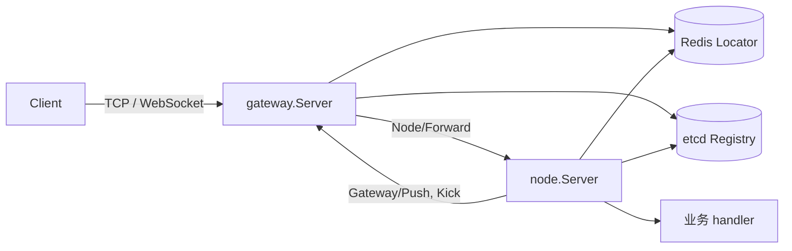

# 架构设计

本文只描述 Yola 的当前实现。接入方式见 [README](./README.md)，未关闭问题见 [当前限制](./issues.md)，性能数据见 [性能基线](./performance.md)。

## 1. 边界与组件

Yola 提供两类 `kratos.transport.Server`：

- `gateway.Server` 持有客户端 TCP/WebSocket 连接，负责认证、Gate lease、Node 发现、路由和回程 Push/Kick。
- `node.Server` 承载业务 command handler，负责 protobuf 适配、request-scoped `Session`、Node binding 和 epoch fencing。

每个 Kratos App 只有一组 Registry identity。Gateway App 与 Node App 必须独立装配；外层 App 自己拥有配置、日志、Registry 和 Redis client，Yola Server 只拥有自身运行状态及子 transport。



| 包 | 职责 |
| --- | --- |
| `api/protocol/v1` | Client↔Gateway envelope、op 码和 `MaxProtoSize` |
| `api/cluster/v1` | Gateway↔Node 内部 gRPC 契约 |
| `network` | `Connection`、`ConnectionHandler`、`Invoker` 与 Transport 契约 |
| `network/tcp`、`network/websocket` | 独立的监听、编解码、心跳、发送队列和 Client |
| `gateway` | Session、认证、Gate lease、Discovery 和路由 |
| `node` | command 注册、Session 注入、Node binding 与 epoch 校验 |
| `locate`、`locate/redis` | Gate/Node 定位契约和 Redis 实现 |
| `instance` | Registry `sticky` metadata 契约 |
| `internal/clusterroute` | `GateBinding` 与集群 wire route 的边界转换 |
| `internal/grpcendpoint`、`internal/listener` | 内部 gRPC advertised endpoint 校验和 listener 所有权 |
| `internal/gateclient` | 直连目标 Gateway 的 gRPC ClientConn 池；调用方持有每次 RPC deadline |
| `internal/queue`、`network/internal/heartbeat` | 跨 transport 稳定复用的有界 callback 执行和单连接 heartbeat 原子状态；不持有 socket 或 transport 生命周期 |
| `network/internal/auth` | 认证回复与认证前 Push 的公共规则；transport 保留帧读取、deadline 和错误身份 |
| `event`、`event/nats` | 在线、可丢失的 Publish/Subscribe 契约与 Core NATS adapter |

应用组装层创建并关闭进程专用的 `event.Bus`。Node usecase 只依赖 `event.Publisher`，Gateway 订阅 handler 固定 Topic 到客户端 command 的映射并调用 `gate.Broadcast`；Gateway/Node 不持有 Bus。事件在线可丢失，不重试、不重放、不补发离线消息，完整边界见 [EventBus 接入](./eventbus.md)。

## 2. 网络与存储

### 2.1 连接方向

| 连接 | 协议与解析 | 负载均衡 |
| --- | --- | --- |
| Client → Gateway | TCP：4B little-endian 长度 + `Proto`；WebSocket：Binary Message | 外部 LB/DNS |
| Gateway → Node | `discovery:///<service>` unary gRPC | `yola_wrr`；粘性请求按 Registry instance ID 精确选 SubConn |
| Node → Gateway | `direct:///<gate_endpoint>` unary gRPC | `pick_first` |
| Gateway → Gateway | 使用旧 `GateBinding` 直连并 Kick 重复登录连接 | `pick_first` |

Node 回程不经过服务发现。`GateRoute.gate_endpoint` 是认证时写入 Redis 的 Gateway 内部 gRPC 地址；Gateway 的 Registry 注册主要用于生命周期和运维可见性。

每个 service 只创建一个 WRR ClientConn。backend pool 与 Gateway 同生命周期，service 名称来自有限的部署目录，因此不做按时间淘汰；首次连接由 pool 自有 context 和 `RPCTimeout` 约束，单个请求取消只结束自身等待，不会取消其他等待者共享的连接创建，Gateway Stop 会取消全部在途连接。Registry 更新负责增删 SubConn；实例集合为空时必须清空旧 SubConn，使请求立即 fail closed。`gateway/balancer.go` 自建 balancer，`gateway/resolver.go` 自建 resolver，是因为 Kratos v3 内置 selector 的初始化顺序不能稳定取得 WRR builder，且内置 discovery resolver 会在空实例集合时沿用旧地址。Gateway 在请求入口创建 `RPCTimeout`，Node ClientConn 直接使用该 context，不再叠加第二个 client timeout。

TCP/WebSocket 在接纳连接与 Stop 之间使用同一 lifecycle owner：Stop 先禁止新连接，再关闭已提交连接并等待 handler/writer 退出；已 Accept 或完成 Upgrade、但尚未提交的连接必须在 Stop 后拒绝。listener 的临时 bind 失败不写入永久状态，独立 transport 可以在端口释放后重新执行 `BeforeStart`。

TCP/WebSocket Client 的 connect、push、Kick 和 disconnect callback 由单一有界队列串行执行。认证期间收到的每个 Push 与 connect callback 都计入容量，并在 worker 启动前作为一个 batch 原子提交；容量不足时连接创建确定失败，不暴露部分 callback。关闭时拒绝新 callback、丢弃尚未开始的普通 callback，让当前 callback 完成后再依次执行 Kick 和 disconnect；连接资源先关闭，再放行 terminal callback，因此 callback 内调用 `Client.Close` 不等待自身。TCP/WebSocket 各自拥有 ticker、I/O 和关闭，只有 `idle → queued → writing → outstanding` 的原子状态迁移由无 transport 依赖的 heartbeat owner 复用。

认证回复的 Push 暂存、容量、op 与拒绝码规则由 `network/internal/auth` 统一处理。TCP/WebSocket 提供每次读取并解码一帧的函数，继续负责各自的帧错误、认证 I/O 取消及 deadline 清理；公共规则不改变 `ErrAuthenticationRejected`、Push 顺序或没有 Push 时的 nil 结果。

TCP/WebSocket 显式 endpoint 是各自 Server 持有的配置副本，`Endpoint()` 返回副本，scheme 必须与是否启用 TLS 一致：TCP 使用 `tcp`/`tcps`，WebSocket 使用 `ws`/`wss`，WebSocket path 必须与 `Path` 完全一致。自动 endpoint 优先使用 `AdvertiseHost`，其次使用非通配 listen host，最后选择 global-unicast interface；不能推导出可发布 host 时直接失败，不发布空地址。

WebSocket Server 私有持有 `http.Server`，调用方只通过 `TLSConfig`、`HandshakeTimeout`、`MaxHeaderBytes` 等显式 Option 配置，不得绕过 Yola transport 生命周期直接调用 `Serve`、`Shutdown` 或 `Close`。

### 2.2 Redis 模型

| Key | 值 | 生命周期 | 用途 |
| --- | --- | --- | --- |
| `locate:gate:{base64url(service\x00uid)}` | `GateBinding` JSON | 默认 60s；heartbeat 按需续租 | 定位物理连接并 fencing |
| `locate:node:{base64url(service\x00uid)}` | NodeID | 固定 6h；业务绑定时刷新 | 定位持有玩家状态的实例 |
| `locate:node:epoch:{base64url(service\x00nodeID)}` | 进程 epoch UUID | 30s；Node 每 10s 续租 | 阻止同 service、同 NodeID 双活 |

`GateBinding` 的 `ServiceName`、`UID`、`GateID`、`GateEndpoint`、`ConnID`、`BindingToken` 全部参与 fencing。Redis key 的 hash tag 固定使用 Raw URL Base64，输入由 `\x00` 分隔，不提供第二套 keyspace。

## 3. 生命周期

Kratos App 的主顺序是：`buildInstance` → 顺序执行 `BeforeStart` hooks → 启动 `Server.Start` → `Registrar.Register`。`buildInstance` 调用 `Endpoint` 时会触发内部 gRPC listener 的惰性 bind；Gateway/Node 通过自己的 listener owner 在本 Server 的初始化回滚和 `Stop` 中显式关闭。

服务入口直接使用 `kratos.New`，显式配置 StopTimeout、BeforeStart、Server 和按需 metadata。Gateway/Node 不提供另一种 App 类型，也不通过隐藏 hooks 改变调用方的装配顺序。

后续其他 Endpointer 或 BeforeStart hook 失败不会自动回滚此前已准备的 Server；已复现后续 hook 失败时 Node listener 仍绑定、epoch 仍保留。当前入口在启动失败后退出进程，epoch 到期回收；若要在同一进程内重建实例，必须先完整清理自己创建的 Server，不能只调用 Kratos App.Stop 并假定早期失败已回收。该限制仍未解决，见 [I42](./issues.md#运行与部署限制)。

Registry、Redis 和 EventBus 由外层创建方拥有。EventBus 构造后已可用，应用组装层在 App.Run 前直接注册订阅；任一底层订阅激活失败都中止本次组装，重试必须重建 Bus。创建 Bus 的组装层在 Run 返回后通过 defer Close 完成最终释放，也可在 BeforeStop 中提前关闭外部输入。

Gateway `NewServer` 校验必需依赖和 Option，并为 TCP/WebSocket 安装 handler。`BeforeStart` 校验 App identity、确认内部 gRPC endpoint、执行 `Locator.Ping`，再准备 TCP/WebSocket 配置和 listener。

`Start` 开放客户端 admission，并让已准备的外部 transport 与内部 gRPC 进入 serving；未调用 `BeforeStart` 时直接失败。

Gateway `Stop`：

1. 关闭客户端 admission，等待已接纳认证及其同步 takeover Kick。
2. 停止 broadcaster，随后从本地 Session Registry 一次性交接全部 Session。
3. 有界停机 worker 通过共享索引动态领取 Session，不构造同长任务队列；在同一停止预算内发送 Kick、关闭连接并执行定位清理。
4. 停止 TCP/WebSocket、内部 gRPC 和 backend ClientConn，汇总所有阶段错误。

Node `NewServer` 校验 Option 并创建内部 gRPC；业务 command 与 disconnect handler 必须在 `BeforeStart` 前注册，运行期不再改变。`BeforeStart` 校验 App identity、确认内部 gRPC endpoint、校验 sticky/Locator 一致性、执行 Locator Ping 并注册 epoch；`Start` 启动 epoch 续租和内部 gRPC。`Stop` 立即拒绝新的 `Forward`、`Disconnect` 和 `PushToUID`，等待已接纳工作；已接纳 handler 持有的 request-scoped `Session.Push` 仍可在排空期间完成。随后执行 `Drain`，最后停止 gRPC、处理 epoch 并关闭 Gateway ClientConn。只有请求排空和 Drain 都完成时才主动注销 epoch；context 取消、超时或 Drain 失败时停止续租，保留 epoch 直到 TTL 过期。可服务 identity 与待清理 epoch credential 分离：注销的普通存储错误保留 credential 供后续 Stop 重试，NotFound/Conflict 视为该 epoch 已不再持有 key 并幂等清除。Node core 不持有 EventBus、Table、玩家或业务后台任务。

Node 的 `requestAdmission` 同时拥有终态标志、已接纳请求计数和排空完成信号。生命周期流程通过该 owner 封闭准入；停止等待本身也封闭准入，不依赖调用方先修改另一个对象的标志。终态查询保持原子读取，请求计数和完成信号由同一锁保护。

每次成功申请 epoch 都创建独立 `epochLease`，固定保存本代凭据，持有续租 context、取消能力和注销状态。lease 只依赖 epoch 存储能力，并通过失效回调通知 Server；它不读取或修改 Server 字段。生命周期锁只负责准备状态、lease 的交接及服务身份发布，注销 I/O 由 lease 自己的锁串行化。清理状态区分持有、注销失败和已释放：重复 Stop 只重试注销失败，排空失败仍保持持有态等待 TTL，不能提前释放。

Kratos 只在全部 `BeforeStart` 成功后启动 Server，正常 App 生命周期不会让 `Stop` 与 `BeforeStart` 重叠。Gateway/Node 的单一初始化 owner 服从 hook context：并发重复调用只拒绝后来者，owner 失败会同步回滚并进入终态，成功后再次调用也会把实例置为终态。Gateway 初始化回滚按逆序停止已尝试资源，每个资源都有独立 `RPCTimeout`。若直接调用的 `Stop` 在准备期间进入，它先发布停止终态并等待初始化 owner 完成回滚；提交检查不会再发布 identity 或写回 Prepared，Node 本次已注册的局部 epoch 也由初始化 owner 注销。Stop context 先结束时返回 context error，初始化 owner 仍继续完成回滚。该保护只保证终态和资源安全，外部仍不得并发调用 `BeforeStart` 与 `Stop`，也不得在同一实例上重试生命周期。

epoch 续租返回 NotFound/Conflict 时，Node 将其提升为 lifecycle fatal，使 `Start` 返回错误并触发 Kratos App 停止流程；已接纳请求与业务 `Drain` 在 `Stop` 预算内完成。该错误路径不承诺 Kratos 显式调用 `Registrar.Deregister`，Registry 摘流仍依赖进程退出和具体注册实现。

Gateway 和 Node 的停止等待使用 Kratos 传入的 context，应用通过 `kratos.StopTimeout` 提供统一预算，业务 `Drain` 服从同一 context。Table 与 mailbox 提供 context-aware 关闭入口；Ludo、Whot 把同一个 `Usecase.Drain` 注册给 Node 并用于 Wire cleanup。Registry 更新传播期间，已注销 Node 仍可能收到旧路由并返回 `Unavailable`；Gateway 不做补偿重试。

## 4. 请求链路

### 4.1 认证与 Gate lease

```text
Client OpAuth
  -> Gateway Authenticator：校验 service/token，返回规范化 UID
  -> Redis BindGate：写入新 binding，原子返回旧 binding
  -> Gateway 提交本地 Session
  -> 若旧 binding 不同，同步 best-effort 直连旧 Gateway 发送 Kick
  -> 回复 OpAuthReply
```

`AuthTimeout` 从连接 `Open` 起算，Authenticator、`BindGate` 和本地提交共享同一 deadline。认证不要求目标 Node 在线。正常断开的 Unbind 与 Disconnect 通知共享一个独立 `RPCTimeout`，不会继承已取消的连接 context，也不会为每一步重新计时；异常退出依赖 TTL。heartbeat 仅在本地剩余 lease 不超过 `LeaseTTL/2` 时访问 Redis 续租。

### 4.2 业务请求

```text
Client OpRequest
  -> Gateway 校验 Session 与 Gate lease
  -> 读取 service 的 sticky 声明
  -> stateless：WRR 选择 Node
  -> sticky 未绑定：查询 Node binding 后使用 WRR
  -> sticky 已绑定：查询 Node binding + epoch，按 NodeID 精确选 SubConn
  -> Node 校验 service、NodeID、epoch，并再次查询 Node binding
  -> 注入 Session，解码 protobuf，调用 handler
  -> Gateway 将 gRPC status/body 写入 OpResponse
```

Node 在 handler 前再次查询 binding，承担改绑 fencing；Redis 调用数量和不能合并的原因见 [性能基线](./performance.md#热路径成本)。

### 4.3 Push、Kick 与 Disconnect

- `Session.Push` 使用当前请求携带的 `GateRoute`，不会重新定位玩家的新连接。
- `Server.PushToUID` 先通过 Locator 查当前 Gate，再直连目标 Gateway。
- Node 回程保留调用方 context 和既有 gRPC status；Gateway 不可用映射为 `Unavailable`，非法 endpoint、TLS 不匹配或 Locator 返回不一致 route 映射为不泄漏底层地址的 `Internal`。
- Gateway Push/Kick 会校验目标 Gate identity、完整 binding、lease 和 `MaxProtoSize`，发送队列满时返回 `ResourceExhausted`。
- 客户端断开和 Gateway 正常停机时，Gateway best-effort 调用 `Node/Disconnect`；重复登录触发的连接替换 Kick 不发送该通知。`Disconnect` 是 at-most-once 的连接事件，可能晚于最后一次 Forward 或玩家重连，不等同业务 Logout。

业务处理 Disconnect 时必须在实际状态所有者（例如 actor/mailbox）内比较 `Session.BindingToken()` 与玩家当前 Session；旧 token 的通知不得修改新连接状态。支付、结算和状态写入仍需业务提供幂等、事务条件或串行化。

## 5. Stateful 粘性路由

`Stateful` 表示业务实例持有玩家状态；`sticky` 是 Yola 的 service 级路由能力。Node 通过 Registry metadata 声明 `sticky=true`，Gateway 不维护业务 service 名单。

- 未声明 `sticky`：使用 service 级 WRR，不访问 Node Locator。
- `sticky=true` 且未绑定：查询结果为空后使用 WRR，handler 可调用 `Session.BindNode`。
- `sticky=true` 且已绑定：精确投递到 NodeID；目标不可用、Locator 失败或 binding 变化时 fail closed，不改投其他 Node。
- `Session.UnbindNode` 仅在当前 NodeID 匹配时删除；`BindNode` 覆盖 NodeID 并刷新 6h TTL。
- Gateway 首次使用 service 时固定其 `sticky` 模式；endpoint 和 NodeID 继续随 discovery 更新，模式变化则 fail closed。`sticky` 是路由语义而非实例健康属性，滚动发布期间可能出现新旧声明混合，因此 Stateful/Stateless 切换必须重启全部 Gateway。

Gateway 不缓存玩家 Node binding 或未绑定结果。Gate close、takeover 和 heartbeat 不修改 Node binding，因此玩家换 Gateway 重连后仍能定位原 Node。Yola 只保证实例定位，不保证内存状态恢复、同 UID 串行、actor 唯一性、幂等或故障迁移。

### 5.1 故障与竞态

| 场景 | 当前行为 |
| --- | --- |
| Gateway 宕机 | Gate binding 随 TTL 清理；Node binding 保留到自身 TTL |
| 玩家换 Gateway 重连 | 新认证覆盖 Gate binding；后续请求仍定位原 Node |
| Node 宕机或网络黑洞 | 等待 gRPC 连接退避/超时或返回 `Unavailable`，不随机改绑 |
| Node 使用原 ID 重启 | Registry/gRPC 恢复后原 binding 可继续使用 |
| Node 使用新 ID 重启 | 旧 binding 在 TTL 内不可达，业务显式改绑或等待过期 |
| 未绑定玩家并发首请求 | 可能进入不同 Node，最终 binding 为 last-write-wins |
| 改绑与旧请求并发 | Node 二次定位阻止未进入 handler 的旧请求；已开始的操作不会撤销 |
| 同 service、同 NodeID 双活 | 后启动者注册 epoch 失败；epoch mismatch 返回 `Aborted` |
| Redis 不可用 | 认证、Gate lease 和粘性请求 fail closed |

6h Node binding TTL 是失效缓存上限，不是存活探测。持续时间更长的业务必须在成功请求中幂等刷新绑定。

## 6. 协议、错误与默认值

### 6.1 外部协议

| Op | 方向 | 说明 |
| --- | --- | --- |
| `OpAuth` / `OpAuthReply` | C→S / S→C | 每连接一次，认证 service 与 token |
| `OpHeartbeat` / `OpHeartbeatReply` | C→S / S→C | 按需续租；TCP 顺延 read deadline，WebSocket 使用 channel read deadline |
| `OpRequest` / `OpResponse` | C→S / S→C | 按 `seq` 关联，`cmd` 路由到 handler |
| `OpPush` | S→C | Node 主动推送，无 `seq` |
| `OpKick` | S→C | 最后一帧后关闭，`code` 说明原因 |

序列化后的 `Proto` 不得超过 `MaxProtoSize = 4096`。`Proto.code` 是唯一框架状态；路由、fencing、transport 和 handler error 经 gRPC status 映射，业务状态放在具体响应 body 中。

### 6.2 默认值

| 层 | 配置 | 默认值 |
| --- | --- | --- |
| Gateway | gRPC handler / `RPCTimeout` / `AuthTimeout` / `LeaseTTL` | 3s / 3s / 15s / 60s |
| Gateway broadcast | worker / queue | `min(8, GOMAXPROCS)` / 256 |
| Node | gRPC handler / `PushTimeout` | 3s / 3s |
| TCP Server | handler / handshake / heartbeat / write / send queue | 3s / 15s / 15s / 10s / 32 |
| TCP Client | ping / read / write / send queue | 5s / 15s / 10s / 100 |
| WebSocket Server | handler / handshake / read / write / send queue | 3s / 15s / 60s / 10s / 32 |
| 连接限制 | `MaxConnLimit` / `MaxConnPerIP` | 10,000 / 100 |
| Redis Locator | Node binding TTL | 6h |

`network.DefaultHandlerTimeout` 统一为 3s，供 TCP/WebSocket 和 Gateway/Node 内部 gRPC 限制单次入站 handler；调用方更短的 deadline 仍优先。TCP/WebSocket 可用 `Timeout`、Node 可用 `HandlerTimeout` 显式覆盖。`AuthTimeout` 只限制未认证连接的总生命周期，不能替代单次 handler deadline。TCP Client read timeout 必须大于 ping interval。TCP/WebSocket Client 都是单连接生命周期，断开后由调用方创建新 Client。连接总量与 per-IP 上限相互独立，压测和经代理部署必须分别核对。

## 7. 部署与安全约束

- Gateway 与 Node 必须使用独立 App 和 Registry identity；Stateful Node instance ID 必须稳定且在线唯一。
- Gateway、Node 与 Locator 必须来自同一版本；首版不支持旧 epoch/key、空 epoch 或新旧协议混部。
- 跨主机部署时，Registry endpoint 和 `GateBinding` 中的 Gateway endpoint 必须对调用方可达。
- 内部 gRPC TLS 的 client/server 配置必须成对启用，只接受与证书配置一致的 `grpc://` 或 `grpcs://` scheme；endpoint 必须是非零数字端口的纯 `host:port`，不得携带 userinfo、path、query 或 fragment。
- Server TLS 必须提供 `Certificates`、`GetCertificate` 或 `GetConfigForClient` 之一，不允许 `InsecureSkipVerify`。通过 TLS Option 接入时 clone `tls.Config` 的顶层配置；调用方不得并发修改共享的证书元素、证书池或 callback 状态，直接配置 WebSocket 公共字段及动态证书 callback 时由调用方维护其状态。经代理暴露客户端真实 IP 前必须先定义可信代理边界。
- Redis/etcd 集成测试只能使用专用实例和隔离 prefix；生产环境必须使用 secret 管理、ACL/mTLS、入口限流和容量验收。

未闭环的部署和性能条件统一记录在 [当前限制](./issues.md)。
