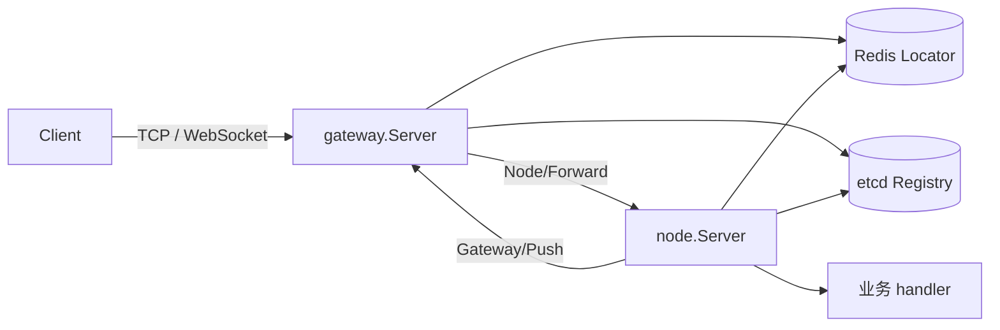

# 架构设计

本文只描述 Yola 的当前实现。接入方式见 [README](./README.md)，未关闭问题见 [当前限制](./issues.md)，性能数据见 [性能基线](./performance.md)。

## 1. 边界与组件

Yola 提供两类 `kratos.transport.Server`：

- `gateway.Server` 持有客户端 TCP/WebSocket 连接，负责认证、Gate lease、Node 发现、路由和回程 Push/Kick。
- `node.Server` 承载业务 command handler，负责 protobuf 适配、request-scoped `Session`、Node binding 和 epoch fencing。

每个 Kratos App 只有一组 Registry identity。Gateway App 与 Node App 必须独立装配；外层 App 自己拥有配置、日志、Registry 和 Redis client，Yola Server 只拥有自身运行状态及子 transport。

Gateway/Node 的停止语义和状态所有者各自独立，复用 listener、回程客户端等有实际共同职责的资源，不增加公共 BaseServer 或只负责转交的管理层。业务状态与执行模型留在 usecase、manager 或 mailbox。



| 包 | 职责 |
| --- | --- |
| `api/protocol/v1` | Client↔Gateway envelope、op 码和 `MaxProtoSize` |
| `api/cluster/v1` | Gateway↔Node 内部 gRPC 契约 |
| `network` | `Connection`、`ConnectionHandler`、`Invoker` 与 Transport 契约 |
| `network/tcp`、`network/websocket` | 独立的监听、编解码、心跳、发送队列和 Client |
| `gateway` | Session、认证、Gate lease、Discovery 和路由 |
| `node` | command 注册、Session 注入、Node binding 与 epoch 校验 |
| `locate`、`locate/redis` | Gate/Node 定位契约和 Redis 实现 |
| `instance` | Registry `sticky` metadata 契约 |
| `internal/clusterroute` | `GateBinding` 与集群 wire route 的边界转换 |
| `internal/grpcendpoint`、`internal/listener` | 内部 gRPC advertised endpoint 校验和 listener 所有权 |
| `internal/gateclient` | 直连目标 Gateway 的 gRPC ClientConn 池；调用方持有每次 RPC deadline |
| `internal/queue`、`network/internal/heartbeat` | 跨 transport 稳定复用的有界 callback 执行和单连接 heartbeat 原子状态；不持有 socket 或 transport 生命周期 |
| `network/internal/auth` | 认证回复与认证前 Push 的公共规则；transport 保留帧读取、deadline 和错误身份 |
| `event`、`event/nats` | 在线、可丢失的 Publish/Subscribe 契约与 Core NATS adapter |

应用组装层创建并关闭进程专用的 `event.Bus`。Node usecase 只依赖 `event.Publisher`，Gateway 订阅 handler 固定 Topic 到客户端 command 的映射并调用 `gate.Broadcast`；Gateway/Node 不持有 Bus。事件在线可丢失，不重试、不重放、不补发离线消息，完整边界见 [EventBus 接入](./eventbus.md)。

## 2. 网络与存储

### 2.1 连接方向

| 连接 | 协议与解析 | 负载均衡 |
| --- | --- | --- |
| Client → Gateway | TCP：4B little-endian 长度 + `Proto`；WebSocket：Binary Message | 外部 LB/DNS |
| Gateway → Node | `discovery:///<service>` unary gRPC | `yola_wrr`；粘性请求按 Registry instance ID 精确选 SubConn |
| Node → Gateway | `direct:///<gate_endpoint>` unary gRPC | `pick_first` |
| Gateway → Gateway | 使用旧 `GateBinding` 直连并 Kick 重复登录连接 | `pick_first` |

Node 回程不经过服务发现。`GateRoute.gate_endpoint` 是认证时写入 Redis 的 Gateway 内部 gRPC 地址；Gateway 的 Registry 注册主要用于生命周期和运维可见性。

Gateway backend 按 service 复用发现连接，回程 gateclient 按 Gate endpoint 管理在途引用和空闲淘汰，二者不合并为通用连接池。Registry 实例集合与 picker 的 Ready SubConn 集合表示不同事实，不能互相替代。

每个 service 只创建一个 WRR ClientConn。backend pool 与 Gateway 同生命周期，service 名称来自有限的部署目录，因此不做按时间淘汰；首次连接由 pool 自有 context 和 `RPCTimeout` 约束，单个请求取消只结束自身等待，不会取消其他等待者共享的连接创建，Gateway Stop 会取消全部在途连接。Registry 更新负责增删 SubConn；实例集合为空时必须清空旧 SubConn，使请求立即 fail closed。`gateway/balancer.go` 自建 balancer，`gateway/resolver.go` 自建 resolver，是因为 Kratos v3 内置 selector 的初始化顺序不能稳定取得 WRR builder，且内置 discovery resolver 会在空实例集合时沿用旧地址。Gateway 在请求入口创建 `RPCTimeout`，Node ClientConn 直接使用该 context，不再叠加第二个 client timeout。

TCP/WebSocket 在接纳连接与 Stop 之间使用同一 lifecycle owner：Stop 先禁止新连接，再关闭已提交连接并等待 handler/writer 退出；已 Accept 或完成 Upgrade、但尚未提交的连接必须在 Stop 后拒绝。listener 的临时 bind 失败不写入永久状态，独立 transport 可以在端口释放后重新执行 `BeforeStart`。

TCP/WebSocket Client 的 connect、push、Kick 和 disconnect callback 由单一有界队列串行执行。认证期间收到的每个 Push 与 connect callback 都计入容量，并在 worker 启动前作为一个 batch 原子提交；容量不足时连接创建确定失败，不暴露部分 callback。关闭时拒绝新 callback、丢弃尚未开始的普通 callback，让当前 callback 完成后再依次执行 Kick 和 disconnect；连接资源先关闭，再放行 terminal callback，因此 callback 内调用 `Client.Close` 不等待自身。TCP/WebSocket 各自拥有 ticker、I/O 和关闭，只有 `idle → queued → writing → outstanding` 的原子状态迁移由无 transport 依赖的 heartbeat owner 复用。

认证回复的 Push 暂存、容量、op 与拒绝码规则由 `network/internal/auth` 统一处理。TCP/WebSocket 提供每次读取并解码一帧的函数，继续负责各自的帧错误、认证 I/O 取消及 deadline 清理；公共规则不改变 `ErrAuthenticationRejected`、Push 顺序或没有 Push 时的 nil 结果。

TCP/WebSocket 显式 endpoint 是各自 Server 持有的配置副本，`Endpoint()` 返回副本，scheme 必须与是否启用 TLS 一致：TCP 使用 `tcp`/`tcps`，WebSocket 使用 `ws`/`wss`，WebSocket path 必须与 `Path` 完全一致。自动 endpoint 优先使用 `AdvertiseHost`，其次使用非通配 listen host，最后选择 global-unicast interface；不能推导出可发布 host 时直接失败，不发布空地址。

WebSocket Server 私有持有 `http.Server`，调用方只通过 `TLSConfig`、`HandshakeTimeout`、`MaxHeaderBytes` 等显式 Option 配置，不得绕过 Yola transport 生命周期直接调用 `Serve`、`Shutdown` 或 `Close`。

WebSocket 默认 codec 由包内 protobuf 实现持有，不受 Kratos 全局同名注册影响；显式 `Codec`/`WithCodec` 使用自定义编码。`PreparedConnection.SendPrepared` 必须在返回前结束对 prepared 对象的访问，只能保留 `Marshal` 返回的不可变 bytes。

### 2.2 Redis 模型

| Key | 值 | 生命周期 | 用途 |
| --- | --- | --- | --- |
| `locate:gate:{base64url(service\x00uid)}` | `GateBinding` JSON | 默认 60s；heartbeat 按需续租 | 定位物理连接并 fencing |
| `locate:node:{base64url(service\x00uid)}` | NodeID | 固定 6h；业务绑定时刷新 | 定位持有玩家状态的实例 |
| `locate:node:epoch:{base64url(service\x00nodeID)}` | 进程 epoch UUID | 30s；Node 每 10s 续租 | 阻止同 service、同 NodeID 双活 |

`GateBinding` 的 `ServiceName`、`UID`、`GateID`、`GateEndpoint`、`ConnID`、`BindingToken` 全部参与 fencing。Redis key 的 hash tag 固定使用 Raw URL Base64，输入由 `\x00` 分隔，不提供第二套 keyspace。

## 3. 生命周期

### 3.1 应用装配

Kratos App 按 `buildInstance` → 顺序执行 `BeforeStart` hooks → 启动 `Server.Start` → `Registrar.Register` → `AfterStart` hooks 运行。`buildInstance` 调用 `Endpoint` 时会触发内部 gRPC listener 的惰性 bind，Gateway/Node 在自身初始化回滚和 `Stop` 中关闭该 listener。

服务入口直接使用 `kratos.New`，显式配置 Context、StopTimeout、BeforeStart、Server 和按需 metadata。正常停止仍由 Kratos 调度。当前 Kratos v3.0.0 在 Endpointer、BeforeStart、注册或 AfterStart 失败时可能直接返回，应用所有者须在 `Run` 返回后取消自有 context，再用独立的 10s 预算调用 Server.Stop，最后关闭 EventBus、Registry、Redis 等外部依赖。`Run` 的原始错误保持不变，额外清理错误单独记录。

不能对每个启动错误直接补调 `App.Stop()`：Kratos 可能已构造 instance，但尚未完成本实例注册，盲目注销会删除同 service、同 ID 的已有注册记录。失败回收通过 `Server.Stop` 清理本次持有的 listener、业务任务与 epoch；etcd Registry 的后台任务绑定到其 `client.Ctx()`，关闭 client 后退出。未完成正常注销的注册记录按原有 etcd lease 回收，默认 TTL 为 15s。

Registry、Redis 和 EventBus 由创建它们的应用层关闭；EventBus 的订阅和释放语义见 [EventBus 接入](./eventbus.md)。Ludo/Whot 的 App provider 返回 Wire cleanup，生成的关闭顺序为 Node → Registry → usecase → Redis；usecase 的重复 Drain 沿用自身幂等规则。

Gateway/Node 实例不支持生命周期重试，也不支持外部并发调用 `BeforeStart` 与 `Stop`。初始化 owner 服从 hook context：并发重复初始化只拒绝后来者；owner 失败同步回滚并进入终态，成功后再次初始化也进入终态。误用时的保护为：Stop 先关闭准入并等待准备结束，初始化提交再次检查终态，不能发布新 identity；Stop 等待超时后，初始化 owner 仍负责完成回滚。

正常停止共用 `kratos.StopTimeout` 提供的预算，业务 Drain 服从同一 context。`Run` 返回后的重复 Stop 不会重做业务 Drain，也不会绕过失败排空释放 epoch；只有先前已允许释放、但注销未完成的 epoch 可以重试。Table 和 mailbox 提供 context-aware 关闭入口。

### 3.2 Gateway

`NewServer` 校验依赖和 Option，并为 TCP/WebSocket 安装 handler。`BeforeStart` 校验 App identity、准备内部 gRPC endpoint、执行 Locator Ping，再准备客户端 transport；失败时按逆序回滚，每个资源使用独立的 `RPCTimeout`。`Start` 必须在准备完成后调用，开放客户端准入并启动客户端 transport 和内部 gRPC。

`Stop` 按顺序执行：

1. 关闭客户端准入，等待已接纳认证及其同步 takeover Kick。
2. 停止 broadcaster，从本地 Session Registry 一次性交接全部 Session。
3. 有界 worker 通过共享索引领取 Session，在停止预算内发送 Kick、关闭连接并清理定位。
4. 停止 TCP/WebSocket、内部 gRPC 和 backend ClientConn，汇总错误。

### 3.3 Node

command 与 disconnect handler 必须在 `BeforeStart` 前注册，运行期不变。`BeforeStart` 校验 App identity、准备 gRPC endpoint、校验 sticky/Locator 一致性、执行 Ping 并按需申请 epoch。已确认注册成功后发生取消或提交失败，由准备 owner 持本次凭据回滚。

Stateful Node 的 `Start` 先检查本地有效期并完成首次续租核验，再开放 gRPC；任一核验失败都拒绝启动。自身启动失败以独立的 `PushTimeout` 预算调用完整 Stop，保留业务 Drain 和 epoch 释放条件。[node/lifecycle.go](../node/lifecycle.go)

两个 `requestAdmission` 分别拥有入站请求和出站投递的终态、在途计数及排空信号，停止等待本身会关闭对应准入。`Stop` 按顺序执行：

1. 拒绝新的 Forward/Disconnect，等待已接收请求返回。
2. 执行业务 Drain；期间 `PushToUID` 和 `Session.Push` 仍可使用，Drain 返回前必须停止自身的推送生产者。
3. 关闭投递准入，等待已接纳的 Push 完成。
4. 停止 gRPC，按排空结果处理 epoch，最后关闭 Gateway ClientConn。

只有请求、业务 Drain 和投递均排空，才撤下可服务 identity、停止并等待续租任务、按固定代次注销 epoch。任一排空失败或超时则停止续租，保留 epoch 到 TTL 回收，重复 Stop 不会绕过失败排空提前释放。已经获准释放、但等待续租任务退出超时或注销失败的凭据，可由后续 Stop 重试；NotFound/Conflict 视为本代已不再持有 key。

Node 不持有 EventBus、Table、玩家或业务后台任务。Session 使用时读取当前身份，不缓存永久有效的 identity；正常停机后保存的 Session 也不能继续绑定或推送。Registry 摘流传播期间，旧路由可能收到 `Unavailable`，Gateway 不做补偿重试。

### 3.4 Node epoch

`epochLease` 拥有本代固定凭据、本地有效期、续租任务和释放状态，只依赖申请、续租、注销三项存储能力。Server 的生命周期锁负责准备和身份交接；identity 与 lease 指针供请求原子读取，lease 自己串行化注销 I/O。[node/epoch.go](../node/epoch.go)

- TTL 为 30s，每 10s 续租；申请和单次续租的 context 最长 3s，续租还受原租约剩余时间限制。
- 本地截止时间使用单调时钟，从成功申请或续租的调用开始计算。迟到响应不能延长或恢复已经失效的身份。
- 运行期普通续租错误只在原有效期内重试；NotFound/Conflict 或本地过期会关闭两类准入，使 Start 返回 lifecycle fatal。
- 过期监视与续租 I/O 独立，存储忽略取消也不会推迟本地失效。Stop 等待任务退出，超时报告错误并保留凭据；框架不能强制终止不响应 context 的实现。
- Forward（包括空 sticky claim）、Disconnect、Session 绑定和 Push 都校验有效期，Node binding 查询返回后再次检查。已接纳操作的 context 随租约失效取消，业务 Drain 使用 Stop 预算。

本地有效期不撤销已执行的业务写入，也不替代业务事务 fencing；忽略 context 的工作可能持续到进程退出。fatal 路径不承诺 Kratos 显式调用 `Registrar.Deregister`，摘流仍取决于进程退出和注册实现。

## 4. 请求链路

### 4.1 认证与 Gate lease

```text
Client OpAuth
  -> Gateway Authenticator：校验 service/token，返回规范化 UID
  -> Redis BindGate：写入新 binding，原子返回旧 binding
  -> Gateway 提交本地 Session
  -> 若旧 binding 不同，同步 best-effort 直连旧 Gateway 发送 Kick
  -> 回复 OpAuthReply
```

`AuthTimeout` 从连接 `Open` 起算，Authenticator、`BindGate` 和本地提交共享同一 deadline。认证不要求目标 Node 在线。正常断开的 Unbind 与 Disconnect 通知共享一个独立 `RPCTimeout`，不会继承已取消的连接 context，也不会为每一步重新计时；异常退出依赖 TTL。heartbeat 仅在本地剩余 lease 不超过 `LeaseTTL/2` 时访问 Redis 续租。

### 4.2 业务请求

```text
Client OpRequest
  -> Gateway 校验 Session 与 Gate lease
  -> 读取 service 的 sticky 声明
  -> stateless：WRR 选择 Node
  -> sticky 未绑定：查询 Node binding 后使用 WRR
  -> sticky 已绑定：查询 Node binding + epoch，按 NodeID 精确选 SubConn
  -> Node 校验 service 与本地租约；有 sticky claim 时校验 NodeID/epoch 并再次查询 binding
  -> 注入 Session，解码 protobuf，调用 handler
  -> Gateway 将 gRPC status/body 写入 OpResponse
```

Node 对已绑定请求在 handler 前再次查询 binding，承担改绑 fencing；Redis 调用数量和不能合并的原因见 [性能基线](./performance.md#热路径成本)。Gateway session 的 handler 锁串行化 Handle/Close，binding 锁允许远程 Kick 在 handler 执行期间使路由失效，两者不能合并。

### 4.3 Push、Kick 与 Disconnect

- `Session.Push` 使用当前请求携带的 `GateRoute`，不会重新定位玩家的新连接。
- `Server.PushToUID` 先通过 Locator 查当前 Gate，再直连目标 Gateway。
- Node 回程保留调用方 context 和既有 gRPC status；Gateway 不可用映射为 `Unavailable`，非法 endpoint、TLS 不匹配或 Locator 返回不一致 route 映射为不泄漏底层地址的 `Internal`。
- Gateway Push/Kick 会校验目标 Gate identity、完整 binding、lease 和 `MaxProtoSize`，发送队列满时返回 `ResourceExhausted`。
- 客户端断开和 Gateway 正常停机时，Gateway best-effort 调用 `Node/Disconnect`；重复登录触发的连接替换 Kick 不发送该通知。`Disconnect` 是 at-most-once 的连接事件，可能晚于最后一次 Forward 或玩家重连，不等同业务 Logout。

Gateway 为 Forward 查询 epoch，Disconnect 仅共用 Node 路由定位，不额外查询 epoch；二者不能合并为失败语义相同的转发流程。

业务处理 Disconnect 时必须在实际状态所有者（例如 actor/mailbox）内比较 `Session.BindingToken()` 与玩家当前 Session；旧 token 的通知不得修改新连接状态。支付、结算和状态写入仍需业务提供幂等、事务条件或串行化。

## 5. Stateful 粘性路由

`Stateful` 表示业务实例持有玩家状态；`sticky` 是 Yola 的 service 级路由能力。Node 通过 Registry metadata 声明 `sticky=true`，Gateway 不维护业务 service 名单。

当前配置 Node Locator 同时启用 Stateful 租约与绑定能力，Stateless Node 因此不能仅为了 `PushToUID` 配置 Locator。只有出现明确的这类调用需求时，才拆分 Gate 寻址与 Node 租约能力。

- 未声明 `sticky`：使用 service 级 WRR，不访问 Node Locator。
- `sticky=true` 且未绑定：查询结果为空后使用 WRR，handler 可调用 `Session.BindNode`。
- `sticky=true` 且已绑定：精确投递到 NodeID；目标不可用、Locator 失败或 binding 变化时 fail closed，不改投其他 Node。
- `Session.UnbindNode` 仅在当前 NodeID 匹配时删除；`BindNode` 覆盖 NodeID 并刷新 6h TTL。
- Gateway 首次使用 service 时固定其 `sticky` 模式；endpoint 和 NodeID 继续随 discovery 更新，模式变化则 fail closed。`sticky` 是路由语义而非实例健康属性，滚动发布期间可能出现新旧声明混合，因此 Stateful/Stateless 切换必须重启全部 Gateway。

Gateway 不缓存玩家 Node binding 或未绑定结果。Gate close、takeover 和 heartbeat 不修改 Node binding，因此玩家换 Gateway 重连后仍能定位原 Node。Yola 只保证实例定位，不保证内存状态恢复、同 UID 串行、actor 唯一性、幂等或故障迁移。

### 5.1 故障与竞态

| 场景 | 当前行为 |
| --- | --- |
| Gateway 宕机 | Gate binding 随 TTL 清理；Node binding 保留到自身 TTL |
| 玩家换 Gateway 重连 | 新认证覆盖 Gate binding；后续请求仍定位原 Node |
| Node 宕机或网络黑洞 | 等待 gRPC 连接退避/超时或返回 `Unavailable`，不随机改绑 |
| Node 使用原 ID 重启 | Registry/gRPC 恢复后原 binding 可继续使用 |
| Node 使用新 ID 重启 | 旧 binding 在 TTL 内不可达，业务显式改绑或等待过期 |
| 未绑定玩家并发首请求 | 可能进入不同 Node，最终 binding 为 last-write-wins |
| 改绑与旧请求并发 | Node 二次定位阻止未进入 handler 的旧请求；已开始的操作不会撤销 |
| 同 service、同 NodeID 双活 | 后启动者注册 epoch 失败；epoch mismatch 返回 `Aborted` |
| Redis 不可用 | 依赖该次查询的认证和粘性请求失败；Node 续租错误在本地有效期内重试，到期关闭准入 |
| prepared Node 租约过期或被替代 | Start 核验失败，不开放 gRPC |

6h Node binding TTL 是失效缓存上限，不是存活探测。持续时间更长的业务必须在成功请求中幂等刷新绑定。

## 6. 协议、错误与默认值

### 6.1 外部协议

| Op | 方向 | 说明 |
| --- | --- | --- |
| `OpAuth` / `OpAuthReply` | C→S / S→C | 每连接一次，认证 service 与 token |
| `OpHeartbeat` / `OpHeartbeatReply` | C→S / S→C | 按需续租；TCP 顺延 read deadline，WebSocket 使用 channel read deadline |
| `OpRequest` / `OpResponse` | C→S / S→C | 按 `seq` 关联，`cmd` 路由到 handler |
| `OpPush` | S→C | Node 主动推送，无 `seq` |
| `OpKick` | S→C | 最后一帧后关闭，`code` 说明原因 |

序列化后的 `Proto` 不得超过 `MaxProtoSize = 4096`。`Proto.code` 是唯一框架状态；路由、fencing、transport 和 handler error 经 gRPC status 映射，业务状态放在具体响应 body 中。

### 6.2 默认值

| 层 | 配置 | 默认值 |
| --- | --- | --- |
| Gateway | gRPC handler / `RPCTimeout` / `AuthTimeout` / `LeaseTTL` | 3s / 3s / 15s / 60s |
| Gateway broadcast | worker / queue | `min(8, GOMAXPROCS)` / 256 |
| Node | gRPC handler / `PushTimeout` | 3s / 3s |
| TCP Server | handler / handshake / heartbeat / write / send queue | 3s / 15s / 15s / 10s / 32 |
| TCP Client | ping / read / write / send queue | 5s / 15s / 10s / 100 |
| WebSocket Server | handler / handshake / read / write / send queue | 3s / 15s / 60s / 10s / 32 |
| 连接限制 | `MaxConnLimit` / `MaxConnPerIP` | 10,000 / 100 |
| Redis Locator | Node binding TTL | 6h |

`network.DefaultHandlerTimeout` 统一为 3s，供 TCP/WebSocket 和 Gateway/Node 内部 gRPC 限制单次入站 handler；调用方更短的 deadline 仍优先。TCP/WebSocket 可用 `Timeout`、Node 可用 `HandlerTimeout` 显式覆盖。`AuthTimeout` 只限制未认证连接的总生命周期，不能替代单次 handler deadline。TCP Client read timeout 必须大于 ping interval。TCP/WebSocket Client 都是单连接生命周期，断开后由调用方创建新 Client。连接总量与 per-IP 上限相互独立，压测和经代理部署必须分别核对。

## 7. 部署与安全约束

- Gateway 与 Node 必须使用独立 App 和 Registry identity；Stateful Node instance ID 必须稳定且在线唯一。
- Gateway、Node 与 Locator 必须来自同一版本；首版不支持旧 epoch/key、空 epoch 或新旧协议混部。
- 跨主机部署时，Registry endpoint 和 `GateBinding` 中的 Gateway endpoint 必须对调用方可达。
- 内部 gRPC TLS 的 client/server 配置必须成对启用，只接受与证书配置一致的 `grpc://` 或 `grpcs://` scheme；endpoint 必须是非零数字端口的纯 `host:port`，不得携带 userinfo、path、query 或 fragment。
- Server TLS 必须提供 `Certificates`、`GetCertificate` 或 `GetConfigForClient` 之一，不允许 `InsecureSkipVerify`。通过 TLS Option 接入时 clone `tls.Config` 的顶层配置；调用方负责共享证书元素、证书池及动态 callback 的并发安全。经代理暴露客户端真实 IP 前必须先定义可信代理边界。
- Redis/etcd 集成测试只能使用专用实例和隔离 prefix；生产环境必须使用 secret 管理、ACL/mTLS、入口限流和容量验收。

未闭环的部署和性能条件统一记录在 [当前限制](./issues.md)。
