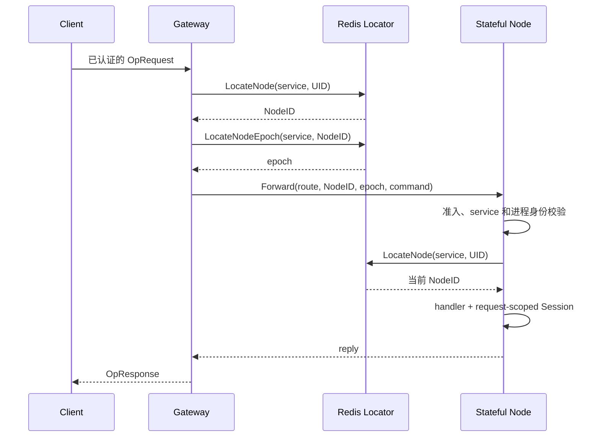

# Gateway/Node 架构复审

状态：本文保留首轮复审快照，已随 `eeb99c4` 提交；下文源码位置、验证及候选状态对应该快照。方案一不再采用新增 App 封装；方案三的 Node 租约所有权整理和当前验证见 [重构实施记录](./gateway-node-refactor.md)，当前架构契约以 [架构设计](./architecture.md) 为准。审查日期：2026-09-06；首轮实施前基线：`8819fbce28ad7acbe0b58d73e9d59f98c547718d`。

结论：有较大的优化空间，主要集中在应用装配的失败回滚，以及 Gateway 与 Node 之间的实例身份、epoch 和路由契约。Gateway 包内现有职责划分较完整；Node 内部还有中等规模的状态归属整理空间。优先解决跨组件资源所有权，再按性能证据决定是否调整请求链路，比继续按文件拆分更有价值。

本次依据当前源码、直接调用方、测试及本地 module cache 中固定版本的 Kratos 实现，不以历史性能记录证明当前收益。项目处于首版开发阶段，可以另行设计 API 和协议；本次已经落地的三个批次保持现有对外契约。

## 已完成的三个批次

| 改动 | 实际收益与保留语义 | 代码 |
| --- | --- | --- |
| NATS 订阅结束后释放 handler，并在后续成功 Subscribe 时回收已结束且无错误的记录 | handler 不再被结束的订阅长期引用；仍等待取消中的 handler，保留历史清理错误供 Close 汇总。记录清理是延后的，不声称 Unsubscribe 立即删除全部记录 | [event/nats/subscription.go:110](../event/nats/subscription.go#L110)、[event/nats/event.go:200](../event/nats/event.go#L200) |
| Node `requestAdmission` 统一拥有停止标志、在途计数和排空信号 | 调用方不再把另一个对象的停止标志传入 admission；停止等待自身封闭准入。保留终态发布时间、锁顺序和 Drain/epoch 条件 | [node/admission.go:12](../node/admission.go#L12)、[node/lifecycle.go:75](../node/lifecycle.go#L75) |
| TCP/WebSocket 复用认证回复规则 | Push 暂存、容量、op、拒绝码只维护一份；各 transport 继续拥有读取、编解码、deadline、取消及自己的拒绝错误身份 | [network/internal/auth/reply.go:12](../network/internal/auth/reply.go#L12) |

没有引入生产依赖，没有修改 `test/`、生成文件或集群协议。本次新增的包边界只承载双方确实共用的认证规则，没有新增公共连接或生命周期实现层。

## 当前架构的真实分工

### 请求和状态链路

上图只表示已绑定 Stateful Forward 的正常路径。Stateless 不查 Node binding/epoch；Stateful 尚未绑定时查到 NotFound 后走 WRR，不读取 epoch。服务发现和 gRPC Ready 状态决定实例是否可选。证据：[gateway/forward.go:87](../gateway/forward.go#L87)、[gateway/forward.go:100](../gateway/forward.go#L100)、[gateway/balancer.go:68](../gateway/balancer.go#L68)、[node/dispatch.go:51](../node/dispatch.go#L51)。

| 状态或资源 | 当前所有者 | 为什么需要这个边界 |
| --- | --- | --- |
| 物理连接、认证结果、Gate lease | Gateway session；Redis 保存租约记录 | 本地是否仍允许发送，与跨 Gateway 定位是不同事实。[gateway/session.go:90](../gateway/session.go#L90) |
| 连接集合及认证提交 | Gateway sessionRegistry | 把连接是否仍存在与绑定提交联系起来，避免已关闭连接重新认证。[gateway/session.go:41](../gateway/session.go#L41) |
| service 的发现快照、ClientConn | Gateway backends/resolver | 处理服务模式、实例集合和共享建连；寿命随 Gateway。[gateway/backend.go:24](../gateway/backend.go#L24) |
| 可用 SubConn 与精确 NodeID 选择 | Gateway picker | Registry 存在不代表连接 Ready；已绑定请求不能改投另一个 Node。[gateway/balancer.go:39](../gateway/balancer.go#L39) |
| Node 请求准入和排空 | Node requestAdmission | 覆盖 Forward、Disconnect、PushToUID；关闭后禁止新增工作。[node/admission.go:12](../node/admission.go#L12) |
| Node 可服务身份、epoch 续租及清理凭据 | Node Server，集中在 lifecycle/epoch | 目前三类状态仍受同一 lifecycleMu 协调，是下一步可收拢的内部边界。[node/server.go:51](../node/server.go#L51) |
| 请求的回程 binding | requestSession | Session.Push 使用原连接路由；PushToUID 查找 UID 的当前连接，两者不能合并为同一种定位。[node/session.go:79](../node/session.go#L79)、[node/push.go:16](../node/push.go#L16) |
| Registry、Redis client、EventBus 等应用依赖 | 创建它们的应用装配代码 | Yola Server 停止自身资源；跨资源失败回滚也应由创建方负责。[examples/whot/main.go:29](../examples/whot/main.go#L29) |

### Gateway：局部重构空间有限，跨组件空间更大

`gateway.Server` 同时参与认证、路由和关闭，表面职责较多，但已经把各自的可变状态放入 sessionRegistry、session、backends、broadcaster、lifecycle 和 admission。外层 Server 主要协调请求和资源顺序，单凭文件数量或方法数量不能判定它需要整体拆掉。证据：[gateway/server.go:49](../gateway/server.go#L49)、[gateway/session.go:14](../gateway/session.go#L14)、[gateway/broadcast.go:48](../gateway/broadcast.go#L48)。

三个现有拆分有必要保留：

- `forward.go → backend.go → resolver.go/balancer.go` 分别处理业务路由、共享连接、发现更新和实际选连接。发现快照中的 NodeID 集合与 picker 的 Ready 集合不能当作重复 map 删除；空实例更新必须清空旧地址，不能继续向旧实例发请求。证据：[gateway/resolver.go:110](../gateway/resolver.go#L110)、[gateway/balancer.go:39](../gateway/balancer.go#L39)。
- session 的 handlerMu 串行化 Handle/Close，bindingMu 保护认证和租约。远程 Kick 需要在另一个 handler 执行期间使 binding 失效，不能直接把两把锁合并。证据：[gateway/inbound.go:30](../gateway/inbound.go#L30)、[gateway/inbound.go:51](../gateway/inbound.go#L51)、[gateway/session.go:191](../gateway/session.go#L191)、[gateway/cluster.go:109](../gateway/cluster.go#L109)。
- Forward 需要 epoch，Disconnect 只做尽力通知并共用 Node 路由解析。强行统一成一个完整转发流程会给 Disconnect 增加 epoch I/O 和不同失败语义。证据：[gateway/forward.go:87](../gateway/forward.go#L87)、[gateway/forward.go:146](../gateway/forward.go#L146)。

因此，不建议再抽一层只把 Server 方法转给 SessionManager 或 RoutingManager 的包装。真正能减少 Gateway 逻辑和请求成本的方案，需要与 Node 的实例身份设计一起调整。

### Node：主要复杂度在生命周期与 epoch 的交叉

Node 的业务主路径较短：准入 → route/service 校验 → sticky fencing → 查 handler → 注入 Session。protobuf 适配位于 register/cluster，业务状态和后台任务通过 Drain 留在业务层。继续给主路径增加 dispatcher、service、repository 层没有已证实的收益。证据：[node/dispatch.go:51](../node/dispatch.go#L51)、[node/register.go:30](../node/register.go#L30)、[node/cluster.go:25](../node/cluster.go#L25)。

需要关注的是 Server 同时维护启动状态、准备完成信号、fatal context、续租 cancel、epoch 清理凭据、清理重试标志及两把相关锁。`epoch.go` 虽已分文件，其方法仍直接操作 Server 字段，资源所有权尚未成为独立、完整的内部职责。证据：[node/server.go:54](../node/server.go#L54)、[node/epoch.go:47](../node/epoch.go#L47)、[node/lifecycle.go:102](../node/lifecycle.go#L102)。

其中两组看似重复的内容有不同含义，不能机械删除：

- `nodeIdentity` 表示当前可服务身份；`nodeEpoch` 表示尚需清理的凭据。停止服务后注销失败，仍要保留后者重试；排空或 Drain 失败时，更不能因持有凭据就立即注销 epoch。证据：[node/epoch.go:47](../node/epoch.go#L47)、[node/epoch.go:55](../node/epoch.go#L55)、[node/lifecycle.go:75](../node/lifecycle.go#L75)。
- requestSession 持有 Server，是为了 BindNode/UnbindNode 使用时读取当前身份。如果改成创建 Session 时捕获一份永不更新的身份，完成 Stop 后仍被保存的 Session 可能继续用旧身份操作 binding。若要收窄依赖，应提供读取当前身份的能力，而不是缓存身份值。证据：[node/session.go:53](../node/session.go#L53)、[node/session.go:88](../node/session.go#L88)。

## 优先方案一：明确应用装配和失败回滚的所有者

**状态：问题已复现；候选设计，尚未实现。优先级最高，规模中等，收益不依赖压测。**

当前使用方需要正确组合 `kratos.Metadata(server.Metadata())`、`kratos.BeforeStart(server.BeforeStart)`、`kratos.Server(server)`，同时安排外部依赖清理。只封装这几个 Option 可以减少重复，但没有解决更重要的失败回滚问题。证据：[examples/whot/main.go:76](../examples/whot/main.go#L76)、[node/server.go:149](../node/server.go#L149)、[node/epoch.go:22](../node/epoch.go#L22)。

固定依赖 Kratos v3.0.0 的 `App.Run` 先执行 buildInstance，再依次执行 BeforeStart；Server 的停止等待 goroutine 在全部 BeforeStart 成功后才建立。任何后续 hook 提前返回错误，都不会通知前面已经准备好的 Node。源码依据：[go.mod:8](../go.mod#L8) 及本地 module cache 的 `github.com/go-kratos/kratos/v3@v3.0.0/app.go:83`。

本次使用临时 Go overlay 执行 `TestAuditLaterAppHookLeavesPreparedNodeOwned`，步骤如下，探针通过后由测试显式 Stop 清理：

1. 用真实 Node listener 和包内 memoryLocator 创建 Stateful Node。
2. 先执行 Node.BeforeStart，再让第二个 App.BeforeStart 返回指定错误。
3. 确认 App.Run 返回该错误，Node 未关闭准入，epoch 仍存在，同地址重新监听失败。

该探针证明的是后续 BeforeStart 失败路径；Registrar.Register、AfterStart 的错误路径在固定版本源码中也有直接返回，但本次没有分别注入故障验证。它们属于后续实施必须核对的路径，不作为已完成验证报告。

建议的装配职责：

- Gateway App、Node App 分别装配，明确一个 App 的 identity；创建 Server 时同步记录资源归属，使 endpoint 聚合阶段失败也有清理依据。
- 将 Yola Server 所需的 metadata、BeforeStart 注册和 Server 注册收敛到同一处，避免调用方漏接。外部注入的借用资源仍由其创建者关闭。
- 对 endpoint、hook、注册以及运行返回统一安排清理；先结束业务和 Server，再关闭它们仍可能使用的 Bus、Redis、Registry client，具体顺序按依赖确定。
- 启动失败后的清理使用独立、有上限的 context，保留原始错误并汇总清理错误；不能只调用 App.Stop，因为早期失败时没有 Server 停止等待者。
- Server 内部仍各自拥有停止语义：Gateway 清理认证、连接和广播，Node 等待请求和 Drain 后决定 epoch 释放。装配方调用这些能力，不直接修改其字段或重复实现其状态机。

最小落地方式是在真实应用装配入口落实有界 cleanup，再根据实际重复决定是否提供复用的装配 API；不先建设一个通用依赖注入或生命周期框架。当前独立 Server 不支持重启，未来同进程恢复也应先清理再重建实例。

验收应覆盖：后续 Endpointer 失败、后续 BeforeStart 失败、注册失败、AfterStart 失败、正常退出、重复清理、清理超时及注销 epoch 失败。必须确认端口释放、后台任务退出和 epoch 保留/删除符合各自条件，且原始启动错误仍可通过 errors.Is/As 识别。

这项工作会扩展应用装配契约；本轮仅补全 [I42](./issues.md#运行与部署限制)，没有把现有行为描述为已经修复。

## 方案二：重整实例身份和 epoch，减少热路径远程查询

**状态：理论成本已确认；候选设计，尚未实现。规模较大，需先取得性能证据并定义新的失效契约。**

当前已绑定 Stateful Forward 正常路径共三次顺序 Redis GET：Gateway 查询 UID 的 NodeID、再查询该实例 epoch，Node 再查一次 UID 的 NodeID。后一次查询可以发现前后发生的解绑或迁移，不能直接删除。证据：[gateway/forward.go:87](../gateway/forward.go#L87)、[gateway/forward.go:100](../gateway/forward.go#L100)、[node/dispatch.go:98](../node/dispatch.go#L98)，Redis 实现见 [locate/redis/node.go:22](../locate/redis/node.go#L22)、[locate/redis/epoch.go:40](../locate/redis/epoch.go#L40)。

有条件的目标是：实例持有 epoch 并发布 `(NodeID, epoch, endpoint)`；Gateway 从同一实例快照取得目标和 epoch，Node 本地确认租约仍有效，再校验 UID binding。正常已绑定 Forward 的 Redis GET 理论上可从 3 次变成 2 次。这是少一次远程往返的结构收益，不代表延迟或吞吐已经改善了某个百分比。

不能直接把 epoch 放进 metadata 后删除查询。目前 Node 对普通续租存储错误继续运行，只有明确 NotFound/Conflict 才触发 fatal；没有独立的本地 lease deadline。若 Gateway 又使用滞后的发现信息，失去 Redis 联系的旧进程可能继续被当作有效实例。证据：[node/epoch.go:122](../node/epoch.go#L122)。

这项设计必须同时解决：

1. Node 根据成功申请/续租建立保守的本地有效期，并约束续租 I/O 时长；不能把延迟返回之后的当前时间直接当成完整新 TTL 的起点。
2. 本地有效期到达后关闭新的有状态工作准入，并明确在途 handler、Drain 和后台业务副作用的处置；拒绝新请求本身不等于已经防止旧任务继续写业务状态。
3. 对没有 sticky claim 的未绑定请求也验证本地实例有效性，避免当前空 claim 分支绕过新保护；相应绑定操作同样服从身份失效规则。
4. 将 epoch 与 endpoint 作为同一代实例发布，处理同 NodeID 重启、旧快照、Ready 连接切换以及空实例集。Gateway 仍不得把绑定请求 fallback 到其他 Node。
5. 保留 Node 对当前 UID binding 的查询，不增加时间缓存；Disconnect 和 Session.Push 的既有语义需要单独核对。

这里还有一个装配前提：Kratos 在 BeforeStart 之前构建 instance，目前 epoch 在 BeforeStart 中才申请。需要显式设计身份准备和发布顺序，不能依赖运行时随意修改 metadata map 来弥合时序。

建议先采集已绑定请求占比、Redis p99/pool wait、端到端延迟，再决定是否实施。若成本不构成实际问题，保留当前链路更简单；若确认需要调整，按“本地租约保护 → 实例发布 → Gateway 读取新身份”的依赖顺序完成迁移，并设计每批可验证的完成条件。固定版本故障注入至少覆盖网络分区、续租阻塞、租约过期、同 ID 新旧进程和旧 Registry 快照。已有 [PERF-01](./code-review.md#p1-性能审查项) 记录了这一前提，本次没有更新历史 benchmark 数字。

## 方案三：让 Node epoch 资源真正拥有自己的状态

**状态：候选，尚未实现。规模中等，主要降低维护成本；与方案二一起确定边界，避免重复重构。**

可把 epoch 的申请结果、续租任务、停止续租、清理凭据和重试串行化收拢为 Node 包内资源。Server 只保留启动/停止顺序、请求准入及可服务身份的发布职责；epoch 资源通过有限的失效通知能力让 Server 停止准入，不持有整个 Server，也不把锁暴露给调用方。

这项抽取是否成立，要看能否让下列不变量由资源自身保证：未提交的申请由创建方回滚；同一代续租只启动一次且可停止；释放失败仍保留可重试凭据；旧 epoch 不能删除新 epoch；外层仅在排空和 Drain 允许后授权主动释放。若仍需要 Server 多处直接改资源字段，或新增方法只是逐一转交，便没有实现净简化。

验收基于现有 epoch/lifecycle 测试，并补齐所有权变化的直接风险：申请后提交失败、Stop 与续租结束、普通清理错误重试、Drain 失败保留租约。保留 identity 与 cleanup credential 的不同生命周期，不以减少字段或锁数量作为验收指标。

## 其他候选与不建议推进的方向

| 方向 | 判断与触发条件 |
| --- | --- |
| 分离 Locator 能力与 Stateful 模式 | 当前配置 Locator 就要求 sticky metadata，而 PushToUID 也需要 Locator；因此 Stateless Node 不能仅为了按 UID Push 而配置它。若产品确实需要这项组合，可区分 Gate 定位能力与 Node 租约/绑定能力，并用明确配置约束合法组合；当前需求未证实，暂不增加模式和接口。证据：[node/epoch.go:22](../node/epoch.go#L22)、[node/push.go:16](../node/push.go#L16) |
| 合并 Gateway backend 池与回程 gateclient 池 | 不建议。前者按有限 service 目录复用并跟踪 Registry，后者按 Gate endpoint 管理在途引用和空闲淘汰，生命周期不同。共用泛型连接池会增加策略分支。证据：[gateway/backend.go:94](../gateway/backend.go#L94)、[internal/gateclient/client.go:92](../internal/gateclient/client.go#L92)、[internal/gateclient/client.go:170](../internal/gateclient/client.go#L170) |
| 批量 Push、Gate lease 批量续租 | 可能降低大规模 fanout 或心跳波次成本，但属于性能与容量设计，需要真实瓶颈证据、逐目标结果和顺序契约；不能仅靠增加 worker 或 queue 判定优化完成。参见 [性能基线](./performance.md) |
| Gateway/Node 公共 BaseServer | 不建议。Gateway 排空连接与认证，Node 排空业务请求并控制 epoch 释放，终态和失败重试规则不同。现有 listener、回程客户端等稳定资源已经复用 |
| 将 Table、mailbox、玩家生命周期移入 node | 不建议作为本次框架简化。Node 当前只需 handler、Session、Drain，业务执行模型留在业务层，依赖更直接 |

## 推荐实施顺序与完成标准

| 顺序 | 工作 | 完成标准 |
| --- | --- | --- |
| 已完成 | NATS 资源回收、Node admission、认证回复规则 | 现有契约保持，新增直接风险测试、完整检查和 race 通过 |
| 下一批优先 | 应用装配的失败回滚 | 启动失败后不靠进程退出释放自身资源；清理顺序、超时和错误可检验 |
| 后续维护批 | Node epoch 状态所有权 | lifecycle 不再跨职责维护续租和清理字段，现有释放条件及错误身份保持；若采用新的 lease 模型则合并安排 |
| 有性能证据后 | 实例身份发布与本地 lease 保护 | 网络分区和旧实例测试通过后，确认减少一次 GET，并复测延迟、吞吐和错误率 |

目前没有证据支持“把 Gateway 和 Node 整体重写会更简单”。可验证的目标是减少调用方必须记住的装配规则、让状态修改集中于其所有者，以及在失效保护完整时减少一次请求远程往返。

## 本轮验证与限制

验证对应本次三个实现批次；以下结果不覆盖尚未实施的候选设计。

- NATS 新回归测试先在原实现上失败，修复后通过；其余新增测试覆盖 admission 关闭/超时，以及认证 Push 顺序、容量、错误身份和读取次数。
- 受影响包测试、修改文件格式化及 gopls diagnostics 已完成。
- Windows 上使用 Go 1.26.6、golangci-lint 2.13.2、CGO_ENABLED=0，`make check` 通过，覆盖根与独立 test 两个 module；`make lint` 通过，两个 module 均为 0 issues，未扩大 exclusion。
- Linux VM 上使用 Go 1.26.6、CGO_ENABLED=1，根 module `go test -race -count=1 -json ./...` 通过：23 个含测试包、383 个顶层测试，测试及子测试共 670 个 pass 事件，无失败、无测试跳过、无 DATA RACE。
- Linux 检查实际运行 `TestGatewayNodeIntegration`。Redis 8 与 etcd 3.5.21 使用本轮独立、可丢弃容器和隔离测试标识；测试后已清理容器及远程临时源码。NATS 测试使用嵌入式 broker，未验证已有 NATS 部署。
- 后续 App hook 失败路径通过临时 overlay 探针复现；探针未加入生产实现或常规测试集。

Windows 原生 race 因本地 C 编译工具链无法编译 runtime/cgo 未完成，已用 Linux race 验证受影响并发行为。没有重新运行性能 benchmark、真实连接容量测试或生产流量 profile，因此不宣称吞吐、内存或 p99 已达到新的性能目标。协议及服务入口未改动，本次没有触发 breaking/build 专项检查。
